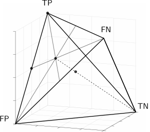
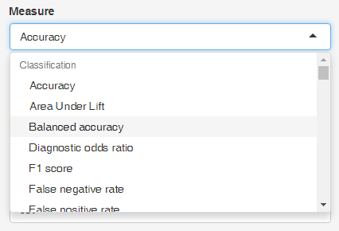
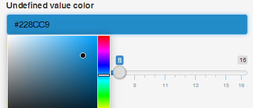
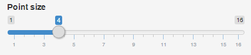
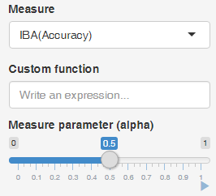
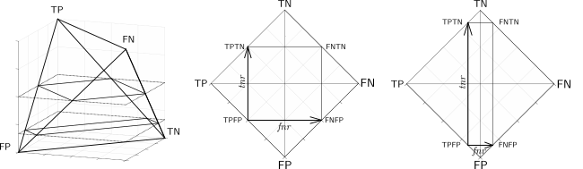
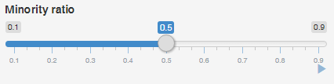

## Help

### 1. Quick theoretical introduction

A confusion matrix for binary classification consists of four entries: $\mathit{TP}$, $\mathit{FP}$, $\mathit{FN}$, $\mathit{TN}$. However, for a dataset of $n$ examples these four entries are constrained, as $n = \mathit{TP} + \mathit{FP} + \mathit{FN} + \mathit{TN}$. Therefore, for a given constant $n$ any three values in the confusion matrix uniquely define the fourth value. This property allows to visualize any classification performance measure based on the two-class confusion matrix using a 4D barycentric coordinate system. A similar property is true for any two-by-two contingency table, for example, those used to define rule interestingness measures.

| Actual \\ Predicted   | Positive  | Negative  | total  |
|:-:|:-:|:-:|:-:|
| **Positive**  | $\mathit{TP}$  | $\mathit{FN}$ |  $P$ |
| **Negative**  | $\mathit{FP}$  | $\mathit{TN}$ |  $N$ |
| **total**  |  $\widehat{P}$ | $\widehat{N}$  | $n$  |

The *barycentric coordinate system* is a coordinate system in which point locations are specified relatively to vertices of a simplex (a triangle, tetrahedron, etc.). A 4D barycentric coordinate system is a tetrahedron, where each dimension is represented as one of the four vertices. Choosing vectors that represent $\mathit{TP}$, $\mathit{FP}$, $\mathit{FN}$, $\mathit{TN}$ as vertices of a regular tetrahedron in a 3D space, one arrives at a barycentric coordinate system depicted below.

In this system, every confusion matrix $\left[ \begin{smallmatrix} \mathit{TP} & \mathit{FN} \\ \mathit{FP} & \mathit{TN} \end{smallmatrix} \right]$ is represented as a point of the tetrahedron. Let us illustrate this fact with a few examples. The above plot shows a skeleton of a tetrahedron with four exemplary points:

- one located in vertex $\mathsf{TP}$, which represents $\left[ \begin{smallmatrix} n & 0 \\ 0 & 0 \end{smallmatrix} \right]$,
- one located in the middle of edge $\mathsf{TP}$--$\mathsf{FP}$, which represents $\left[ \begin{smallmatrix} n/2 & 0 \\ n/2 & 0 \end{smallmatrix} \right]$,
- one located in the middle of face $\triangle\mathsf{TP}$--$\mathsf{FP}$--$\mathsf{FN}$, which represents $\left[ \begin{smallmatrix} n/3 & n/3 \\ n/3 & 0 \end{smallmatrix} \right]$,
- one located in the middle of the tetrahedron, which represents $\left[ \begin{smallmatrix} n/4 & n/4 \\ n/4 & n/4 \end{smallmatrix} \right]$.

One way of understanding this representation is to imagine a point in the tetrahedron as the center of mass of the examples in a confusion matrix. If all $n$ examples are true positives, then the entire mass of the predictions is at $\mathit{TP}$ and the point coincides with vertex $\mathsf{TP}$. If all examples are false negatives, the point lies on vertex $\mathsf{FN}$, etc. Generally, whenever $a > b$ ($a, b \in \{\mathit{TP},\mathit{FN},\mathit{FP},\mathit{TN}\}$) then the point is closer to the vertex corresponding to $a$ rather than $b$.

Using the barycentric coordinate system makes it possible to depict the originally 4D data (two-class confusion matrices) as points in 3D. Moreover, an additional variable based on the depicted four values may be rendered as color. In this application, we adapt this procedure to color-code the values of classification performance and rule interestingness measures.

Detailed information about the visualization and its applications can be found in <a href="https://www.amcs.uz.zgora.pl/?action=paper&paper=827" target="_blank">(Susmaga & Szczech, 2015)</a> and <a href="http://www.cs.put.poznan.pl/dbrzezinski/publications/TetrahedronMeasureVisualization.pdf" target="_blank">(Brzezinski et al., to appear)</a>.

### 2. Rotating and zooming the tetrahedron

The tetrahedron visualization can be rotated and zoomed. To
rotate the tetrahedron simply **drag** (click with left button and move mouse) 
the tetrahedron. To zoom in and out use the **scroll wheel** or right mouse
button. You can try out both actions on the tetrahedron below:

<script type="application/json" data-for="htmlwidget-5d8052eefe02c448a8bf">{"x":{"material":{"color":"#000000","alpha":1,"lit":true,"ambient":"#000000","specular":"#FFFFFF","emission":"#000000","shininess":50,"smooth":true,"front":"filled","back":"filled","size":3,"lwd":1,"fog":false,"point_antialias":false,"line_antialias":false,"texture":null,"textype":"rgb","texmipmap":false,"texminfilter":"linear","texmagfilter":"linear","texenvmap":false,"depth_mask":true,"depth_test":"less","isTransparent":false},"rootSubscene":1,"objects":{"21":{"id":21,"type":"points","material":{"lit":false,"size":8},"vertices":[[1,-1,-1],[0.875,-1,-0.875],[0.75,-1,-0.75],[0.625,-1,-0.625],[0.5,-1,-0.5],[0.375,-1,-0.375],[0.25,-1,-0.25],[0.125,-1,-0.125],[0,-1,0],[-0.125,-1,0.125],[-0.25,-1,0.25],[-0.375,-1,0.375],[-0.5,-1,0.5],[-0.625,-1,0.625],[-0.75,-1,0.75],[-0.875,-1,0.875],[-1,-1,1],[0.875,-0.875,-1],[0.75,-0.875,-0.875],[0.625,-0.875,-0.75],[0.5,-0.875,-0.625],[0.375,-0.875,-0.5],[0.25,-0.875,-0.375],[0.125,-0.875,-0.25],[0,-0.875,-0.125],[-0.125,-0.875,0],[-0.25,-0.875,0.125],[-0.375,-0.875,0.25],[-0.5,-0.875,0.375],[-0.625,-0.875,0.5],[-0.75,-0.875,0.625],[-0.875,-0.875,0.75],[-1,-0.875,0.875],[0.75,-0.75,-1],[0.625,-0.75,-0.875],[0.5,-0.75,-0.75],[0.375,-0.75,-0.625],[0.25,-0.75,-0.5],[0.125,-0.75,-0.375],[0,-0.75,-0.25],[-0.125,-0.75,-0.125],[-0.25,-0.75,0],[-0.375,-0.75,0.125],[-0.5,-0.75,0.25],[-0.625,-0.75,0.375],[-0.75,-0.75,0.5],[-0.875,-0.75,0.625],[-1,-0.75,0.75],[0.625,-0.625,-1],[0.5,-0.625,-0.875],[0.375,-0.625,-0.75],[0.25,-0.625,-0.625],[0.125,-0.625,-0.5],[0,-0.625,-0.375],[-0.125,-0.625,-0.25],[-0.25,-0.625,-0.125],[-0.375,-0.625,0],[-0.5,-0.625,0.125],[-0.625,-0.625,0.25],[-0.75,-0.625,0.375],[-0.875,-0.625,0.5],[-1,-0.625,0.625],[0.5,-0.5,-1],[0.375,-0.5,-0.875],[0.25,-0.5,-0.75],[0.125,-0.5,-0.625],[0,-0.5,-0.5],[-0.125,-0.5,-0.375],[-0.25,-0.5,-0.25],[-0.375,-0.5,-0.125],[-0.5,-0.5,0],[-0.625,-0.5,0.125],[-0.75,-0.5,0.25],[-0.875,-0.5,0.375],[-1,-0.5,0.5],[0.375,-0.375,-1],[0.25,-0.375,-0.875],[0.125,-0.375,-0.75],[0,-0.375,-0.625],[-0.125,-0.375,-0.5],[-0.25,-0.375,-0.375],[-0.375,-0.375,-0.25],[-0.5,-0.375,-0.125],[-0.625,-0.375,0],[-0.75,-0.375,0.125],[-0.875,-0.375,0.25],[-1,-0.375,0.375],[0.25,-0.25,-1],[0.125,-0.25,-0.875],[0,-0.25,-0.75],[-0.125,-0.25,-0.625],[-0.25,-0.25,-0.5],[-0.375,-0.25,-0.375],[-0.5,-0.25,-0.25],[-0.625,-0.25,-0.125],[-0.75,-0.25,0],[-0.875,-0.25,0.125],[-1,-0.25,0.25],[0.125,-0.125,-1],[0,-0.125,-0.875],[-0.125,-0.125,-0.75],[-0.25,-0.125,-0.625],[-0.375,-0.125,-0.5],[-0.5,-0.125,-0.375],[-0.625,-0.125,-0.25],[-0.75,-0.125,-0.125],[-0.875,-0.125,0],[-1,-0.125,0.125],[0,0,-1],[-0.125,0,-0.875],[-0.25,0,-0.75],[-0.375,0,-0.625],[-0.5,0,-0.5],[-0.625,0,-0.375],[-0.75,0,-0.25],[-0.875,0,-0.125],[-1,0,0],[-0.125,0.125,-1],[-0.25,0.125,-0.875],[-0.375,0.125,-0.75],[-0.5,0.125,-0.625],[-0.625,0.125,-0.5],[-0.75,0.125,-0.375],[-0.875,0.125,-0.25],[-1,0.125,-0.125],[-0.25,0.25,-1],[-0.375,0.25,-0.875],[-0.5,0.25,-0.75],[-0.625,0.25,-0.625],[-0.75,0.25,-0.5],[-0.875,0.25,-0.375],[-1,0.25,-0.25],[-0.375,0.375,-1],[-0.5,0.375,-0.875],[-0.625,0.375,-0.75],[-0.75,0.375,-0.625],[-0.875,0.375,-0.5],[-1,0.375,-0.375],[-0.5,0.5,-1],[-0.625,0.5,-0.875],[-0.75,0.5,-0.75],[-0.875,0.5,-0.625],[-1,0.5,-0.5],[-0.625,0.625,-1],[-0.75,0.625,-0.875],[-0.875,0.625,-0.75],[-1,0.625,-0.625],[-0.75,0.75,-1],[-0.875,0.75,-0.875],[-1,0.75,-0.75],[-0.875,0.875,-1],[-1,0.875,-0.875],[-1,1,-1],[1,-0.875,-0.875],[0.875,-0.875,-0.75],[0.75,-0.875,-0.625],[0.625,-0.875,-0.5],[0.5,-0.875,-0.375],[0.375,-0.875,-0.25],[0.25,-0.875,-0.125],[0.125,-0.875,0],[0,-0.875,0.125],[-0.125,-0.875,0.25],[-0.25,-0.875,0.375],[-0.375,-0.875,0.5],[-0.5,-0.875,0.625],[-0.625,-0.875,0.75],[-0.75,-0.875,0.875],[-0.875,-0.875,1],[0.875,-0.75,-0.875],[0.75,-0.75,-0.75],[0.625,-0.75,-0.625],[0.5,-0.75,-0.5],[0.375,-0.75,-0.375],[0.25,-0.75,-0.25],[0.125,-0.75,-0.125],[0,-0.75,0],[-0.125,-0.75,0.125],[-0.25,-0.75,0.25],[-0.375,-0.75,0.375],[-0.5,-0.75,0.5],[-0.625,-0.75,0.625],[-0.75,-0.75,0.75],[-0.875,-0.75,0.875],[0.75,-0.625,-0.875],[0.625,-0.625,-0.75],[0.5,-0.625,-0.625],[0.375,-0.625,-0.5],[0.25,-0.625,-0.375],[0.125,-0.625,-0.25],[0,-0.625,-0.125],[-0.125,-0.625,0],[-0.25,-0.625,0.125],[-0.375,-0.625,0.25],[-0.5,-0.625,0.375],[-0.625,-0.625,0.5],[-0.75,-0.625,0.625],[-0.875,-0.625,0.75],[0.625,-0.5,-0.875],[0.5,-0.5,-0.75],[0.375,-0.5,-0.625],[0.25,-0.5,-0.5],[0.125,-0.5,-0.375],[0,-0.5,-0.25],[-0.125,-0.5,-0.125],[-0.25,-0.5,0],[-0.375,-0.5,0.125],[-0.5,-0.5,0.25],[-0.625,-0.5,0.375],[-0.75,-0.5,0.5],[-0.875,-0.5,0.625],[0.5,-0.375,-0.875],[0.375,-0.375,-0.75],[0.25,-0.375,-0.625],[0.125,-0.375,-0.5],[0,-0.375,-0.375],[-0.125,-0.375,-0.25],[-0.25,-0.375,-0.125],[-0.375,-0.375,0],[-0.5,-0.375,0.125],[-0.625,-0.375,0.25],[-0.75,-0.375,0.375],[-0.875,-0.375,0.5],[0.375,-0.25,-0.875],[0.25,-0.25,-0.75],[0.125,-0.25,-0.625],[0,-0.25,-0.5],[-0.125,-0.25,-0.375],[-0.25,-0.25,-0.25],[-0.375,-0.25,-0.125],[-0.5,-0.25,0],[-0.625,-0.25,0.125],[-0.75,-0.25,0.25],[-0.875,-0.25,0.375],[0.25,-0.125,-0.875],[0.125,-0.125,-0.75],[0,-0.125,-0.625],[-0.125,-0.125,-0.5],[-0.25,-0.125,-0.375],[-0.375,-0.125,-0.25],[-0.5,-0.125,-0.125],[-0.625,-0.125,0],[-0.75,-0.125,0.125],[-0.875,-0.125,0.25],[0.125,0,-0.875],[0,0,-0.75],[-0.125,0,-0.625],[-0.25,0,-0.5],[-0.375,0,-0.375],[-0.5,0,-0.25],[-0.625,0,-0.125],[-0.75,0,0],[-0.875,0,0.125],[0,0.125,-0.875],[-0.125,0.125,-0.75],[-0.25,0.125,-0.625],[-0.375,0.125,-0.5],[-0.5,0.125,-0.375],[-0.625,0.125,-0.25],[-0.75,0.125,-0.125],[-0.875,0.125,0],[-0.125,0.25,-0.875],[-0.25,0.25,-0.75],[-0.375,0.25,-0.625],[-0.5,0.25,-0.5],[-0.625,0.25,-0.375],[-0.75,0.25,-0.25],[-0.875,0.25,-0.125],[-0.25,0.375,-0.875],[-0.375,0.375,-0.75],[-0.5,0.375,-0.625],[-0.625,0.375,-0.5],[-0.75,0.375,-0.375],[-0.875,0.375,-0.25],[-0.375,0.5,-0.875],[-0.5,0.5,-0.75],[-0.625,0.5,-0.625],[-0.75,0.5,-0.5],[-0.875,0.5,-0.375],[-0.5,0.625,-0.875],[-0.625,0.625,-0.75],[-0.75,0.625,-0.625],[-0.875,0.625,-0.5],[-0.625,0.75,-0.875],[-0.75,0.75,-0.75],[-0.875,0.75,-0.625],[-0.75,0.875,-0.875],[-0.875,0.875,-0.75],[-0.875,1,-0.875],[1,-0.75,-0.75],[0.875,-0.75,-0.625],[0.75,-0.75,-0.5],[0.625,-0.75,-0.375],[0.5,-0.75,-0.25],[0.375,-0.75,-0.125],[0.25,-0.75,0],[0.125,-0.75,0.125],[0,-0.75,0.25],[-0.125,-0.75,0.375],[-0.25,-0.75,0.5],[-0.375,-0.75,0.625],[-0.5,-0.75,0.75],[-0.625,-0.75,0.875],[-0.75,-0.75,1],[0.875,-0.625,-0.75],[0.75,-0.625,-0.625],[0.625,-0.625,-0.5],[0.5,-0.625,-0.375],[0.375,-0.625,-0.25],[0.25,-0.625,-0.125],[0.125,-0.625,0],[0,-0.625,0.125],[-0.125,-0.625,0.25],[-0.25,-0.625,0.375],[-0.375,-0.625,0.5],[-0.5,-0.625,0.625],[-0.625,-0.625,0.75],[-0.75,-0.625,0.875],[0.75,-0.5,-0.75],[0.625,-0.5,-0.625],[0.5,-0.5,-0.5],[0.375,-0.5,-0.375],[0.25,-0.5,-0.25],[0.125,-0.5,-0.125],[0,-0.5,0],[-0.125,-0.5,0.125],[-0.25,-0.5,0.25],[-0.375,-0.5,0.375],[-0.5,-0.5,0.5],[-0.625,-0.5,0.625],[-0.75,-0.5,0.75],[0.625,-0.375,-0.75],[0.5,-0.375,-0.625],[0.375,-0.375,-0.5],[0.25,-0.375,-0.375],[0.125,-0.375,-0.25],[0,-0.375,-0.125],[-0.125,-0.375,0],[-0.25,-0.375,0.125],[-0.375,-0.375,0.25],[-0.5,-0.375,0.375],[-0.625,-0.375,0.5],[-0.75,-0.375,0.625],[0.5,-0.25,-0.75],[0.375,-0.25,-0.625],[0.25,-0.25,-0.5],[0.125,-0.25,-0.375],[0,-0.25,-0.25],[-0.125,-0.25,-0.125],[-0.25,-0.25,0],[-0.375,-0.25,0.125],[-0.5,-0.25,0.25],[-0.625,-0.25,0.375],[-0.75,-0.25,0.5],[0.375,-0.125,-0.75],[0.25,-0.125,-0.625],[0.125,-0.125,-0.5],[0,-0.125,-0.375],[-0.125,-0.125,-0.25],[-0.25,-0.125,-0.125],[-0.375,-0.125,0],[-0.5,-0.125,0.125],[-0.625,-0.125,0.25],[-0.75,-0.125,0.375],[0.25,0,-0.75],[0.125,0,-0.625],[0,0,-0.5],[-0.125,0,-0.375],[-0.25,0,-0.25],[-0.375,0,-0.125],[-0.5,0,0],[-0.625,0,0.125],[-0.75,0,0.25],[0.125,0.125,-0.75],[0,0.125,-0.625],[-0.125,0.125,-0.5],[-0.25,0.125,-0.375],[-0.375,0.125,-0.25],[-0.5,0.125,-0.125],[-0.625,0.125,0],[-0.75,0.125,0.125],[0,0.25,-0.75],[-0.125,0.25,-0.625],[-0.25,0.25,-0.5],[-0.375,0.25,-0.375],[-0.5,0.25,-0.25],[-0.625,0.25,-0.125],[-0.75,0.25,0],[-0.125,0.375,-0.75],[-0.25,0.375,-0.625],[-0.375,0.375,-0.5],[-0.5,0.375,-0.375],[-0.625,0.375,-0.25],[-0.75,0.375,-0.125],[-0.25,0.5,-0.75],[-0.375,0.5,-0.625],[-0.5,0.5,-0.5],[-0.625,0.5,-0.375],[-0.75,0.5,-0.25],[-0.375,0.625,-0.75],[-0.5,0.625,-0.625],[-0.625,0.625,-0.5],[-0.75,0.625,-0.375],[-0.5,0.75,-0.75],[-0.625,0.75,-0.625],[-0.75,0.75,-0.5],[-0.625,0.875,-0.75],[-0.75,0.875,-0.625],[-0.75,1,-0.75],[1,-0.625,-0.625],[0.875,-0.625,-0.5],[0.75,-0.625,-0.375],[0.625,-0.625,-0.25],[0.5,-0.625,-0.125],[0.375,-0.625,0],[0.25,-0.625,0.125],[0.125,-0.625,0.25],[0,-0.625,0.375],[-0.125,-0.625,0.5],[-0.25,-0.625,0.625],[-0.375,-0.625,0.75],[-0.5,-0.625,0.875],[-0.625,-0.625,1],[0.875,-0.5,-0.625],[0.75,-0.5,-0.5],[0.625,-0.5,-0.375],[0.5,-0.5,-0.25],[0.375,-0.5,-0.125],[0.25,-0.5,0],[0.125,-0.5,0.125],[0,-0.5,0.25],[-0.125,-0.5,0.375],[-0.25,-0.5,0.5],[-0.375,-0.5,0.625],[-0.5,-0.5,0.75],[-0.625,-0.5,0.875],[0.75,-0.375,-0.625],[0.625,-0.375,-0.5],[0.5,-0.375,-0.375],[0.375,-0.375,-0.25],[0.25,-0.375,-0.125],[0.125,-0.375,0],[0,-0.375,0.125],[-0.125,-0.375,0.25],[-0.25,-0.375,0.375],[-0.375,-0.375,0.5],[-0.5,-0.375,0.625],[-0.625,-0.375,0.75],[0.625,-0.25,-0.625],[0.5,-0.25,-0.5],[0.375,-0.25,-0.375],[0.25,-0.25,-0.25],[0.125,-0.25,-0.125],[0,-0.25,0],[-0.125,-0.25,0.125],[-0.25,-0.25,0.25],[-0.375,-0.25,0.375],[-0.5,-0.25,0.5],[-0.625,-0.25,0.625],[0.5,-0.125,-0.625],[0.375,-0.125,-0.5],[0.25,-0.125,-0.375],[0.125,-0.125,-0.25],[0,-0.125,-0.125],[-0.125,-0.125,0],[-0.25,-0.125,0.125],[-0.375,-0.125,0.25],[-0.5,-0.125,0.375],[-0.625,-0.125,0.5],[0.375,0,-0.625],[0.25,0,-0.5],[0.125,0,-0.375],[0,0,-0.25],[-0.125,0,-0.125],[-0.25,0,0],[-0.375,0,0.125],[-0.5,0,0.25],[-0.625,0,0.375],[0.25,0.125,-0.625],[0.125,0.125,-0.5],[0,0.125,-0.375],[-0.125,0.125,-0.25],[-0.25,0.125,-0.125],[-0.375,0.125,0],[-0.5,0.125,0.125],[-0.625,0.125,0.25],[0.125,0.25,-0.625],[0,0.25,-0.5],[-0.125,0.25,-0.375],[-0.25,0.25,-0.25],[-0.375,0.25,-0.125],[-0.5,0.25,0],[-0.625,0.25,0.125],[0,0.375,-0.625],[-0.125,0.375,-0.5],[-0.25,0.375,-0.375],[-0.375,0.375,-0.25],[-0.5,0.375,-0.125],[-0.625,0.375,0],[-0.125,0.5,-0.625],[-0.25,0.5,-0.5],[-0.375,0.5,-0.375],[-0.5,0.5,-0.25],[-0.625,0.5,-0.125],[-0.25,0.625,-0.625],[-0.375,0.625,-0.5],[-0.5,0.625,-0.375],[-0.625,0.625,-0.25],[-0.375,0.75,-0.625],[-0.5,0.75,-0.5],[-0.625,0.75,-0.375],[-0.5,0.875,-0.625],[-0.625,0.875,-0.5],[-0.625,1,-0.625],[1,-0.5,-0.5],[0.875,-0.5,-0.375],[0.75,-0.5,-0.25],[0.625,-0.5,-0.125],[0.5,-0.5,0],[0.375,-0.5,0.125],[0.25,-0.5,0.25],[0.125,-0.5,0.375],[0,-0.5,0.5],[-0.125,-0.5,0.625],[-0.25,-0.5,0.75],[-0.375,-0.5,0.875],[-0.5,-0.5,1],[0.875,-0.375,-0.5],[0.75,-0.375,-0.375],[0.625,-0.375,-0.25],[0.5,-0.375,-0.125],[0.375,-0.375,0],[0.25,-0.375,0.125],[0.125,-0.375,0.25],[0,-0.375,0.375],[-0.125,-0.375,0.5],[-0.25,-0.375,0.625],[-0.375,-0.375,0.75],[-0.5,-0.375,0.875],[0.75,-0.25,-0.5],[0.625,-0.25,-0.375],[0.5,-0.25,-0.25],[0.375,-0.25,-0.125],[0.25,-0.25,0],[0.125,-0.25,0.125],[0,-0.25,0.25],[-0.125,-0.25,0.375],[-0.25,-0.25,0.5],[-0.375,-0.25,0.625],[-0.5,-0.25,0.75],[0.625,-0.125,-0.5],[0.5,-0.125,-0.375],[0.375,-0.125,-0.25],[0.25,-0.125,-0.125],[0.125,-0.125,0],[0,-0.125,0.125],[-0.125,-0.125,0.25],[-0.25,-0.125,0.375],[-0.375,-0.125,0.5],[-0.5,-0.125,0.625],[0.5,0,-0.5],[0.375,0,-0.375],[0.25,0,-0.25],[0.125,0,-0.125],[0,0,0],[-0.125,0,0.125],[-0.25,0,0.25],[-0.375,0,0.375],[-0.5,0,0.5],[0.375,0.125,-0.5],[0.25,0.125,-0.375],[0.125,0.125,-0.25],[0,0.125,-0.125],[-0.125,0.125,0],[-0.25,0.125,0.125],[-0.375,0.125,0.25],[-0.5,0.125,0.375],[0.25,0.25,-0.5],[0.125,0.25,-0.375],[0,0.25,-0.25],[-0.125,0.25,-0.125],[-0.25,0.25,0],[-0.375,0.25,0.125],[-0.5,0.25,0.25],[0.125,0.375,-0.5],[0,0.375,-0.375],[-0.125,0.375,-0.25],[-0.25,0.375,-0.125],[-0.375,0.375,0],[-0.5,0.375,0.125],[0,0.5,-0.5],[-0.125,0.5,-0.375],[-0.25,0.5,-0.25],[-0.375,0.5,-0.125],[-0.5,0.5,0],[-0.125,0.625,-0.5],[-0.25,0.625,-0.375],[-0.375,0.625,-0.25],[-0.5,0.625,-0.125],[-0.25,0.75,-0.5],[-0.375,0.75,-0.375],[-0.5,0.75,-0.25],[-0.375,0.875,-0.5],[-0.5,0.875,-0.375],[-0.5,1,-0.5],[1,-0.375,-0.375],[0.875,-0.375,-0.25],[0.75,-0.375,-0.125],[0.625,-0.375,0],[0.5,-0.375,0.125],[0.375,-0.375,0.25],[0.25,-0.375,0.375],[0.125,-0.375,0.5],[0,-0.375,0.625],[-0.125,-0.375,0.75],[-0.25,-0.375,0.875],[-0.375,-0.375,1],[0.875,-0.25,-0.375],[0.75,-0.25,-0.25],[0.625,-0.25,-0.125],[0.5,-0.25,0],[0.375,-0.25,0.125],[0.25,-0.25,0.25],[0.125,-0.25,0.375],[0,-0.25,0.5],[-0.125,-0.25,0.625],[-0.25,-0.25,0.75],[-0.375,-0.25,0.875],[0.75,-0.125,-0.375],[0.625,-0.125,-0.25],[0.5,-0.125,-0.125],[0.375,-0.125,0],[0.25,-0.125,0.125],[0.125,-0.125,0.25],[0,-0.125,0.375],[-0.125,-0.125,0.5],[-0.25,-0.125,0.625],[-0.375,-0.125,0.75],[0.625,0,-0.375],[0.5,0,-0.25],[0.375,0,-0.125],[0.25,0,0],[0.125,0,0.125],[0,0,0.25],[-0.125,0,0.375],[-0.25,0,0.5],[-0.375,0,0.625],[0.5,0.125,-0.375],[0.375,0.125,-0.25],[0.25,0.125,-0.125],[0.125,0.125,0],[0,0.125,0.125],[-0.125,0.125,0.25],[-0.25,0.125,0.375],[-0.375,0.125,0.5],[0.375,0.25,-0.375],[0.25,0.25,-0.25],[0.125,0.25,-0.125],[0,0.25,0],[-0.125,0.25,0.125],[-0.25,0.25,0.25],[-0.375,0.25,0.375],[0.25,0.375,-0.375],[0.125,0.375,-0.25],[0,0.375,-0.125],[-0.125,0.375,0],[-0.25,0.375,0.125],[-0.375,0.375,0.25],[0.125,0.5,-0.375],[0,0.5,-0.25],[-0.125,0.5,-0.125],[-0.25,0.5,0],[-0.375,0.5,0.125],[0,0.625,-0.375],[-0.125,0.625,-0.25],[-0.25,0.625,-0.125],[-0.375,0.625,0],[-0.125,0.75,-0.375],[-0.25,0.75,-0.25],[-0.375,0.75,-0.125],[-0.25,0.875,-0.375],[-0.375,0.875,-0.25],[-0.375,1,-0.375],[1,-0.25,-0.25],[0.875,-0.25,-0.125],[0.75,-0.25,0],[0.625,-0.25,0.125],[0.5,-0.25,0.25],[0.375,-0.25,0.375],[0.25,-0.25,0.5],[0.125,-0.25,0.625],[0,-0.25,0.75],[-0.125,-0.25,0.875],[-0.25,-0.25,1],[0.875,-0.125,-0.25],[0.75,-0.125,-0.125],[0.625,-0.125,0],[0.5,-0.125,0.125],[0.375,-0.125,0.25],[0.25,-0.125,0.375],[0.125,-0.125,0.5],[0,-0.125,0.625],[-0.125,-0.125,0.75],[-0.25,-0.125,0.875],[0.75,0,-0.25],[0.625,0,-0.125],[0.5,0,0],[0.375,0,0.125],[0.25,0,0.25],[0.125,0,0.375],[0,0,0.5],[-0.125,0,0.625],[-0.25,0,0.75],[0.625,0.125,-0.25],[0.5,0.125,-0.125],[0.375,0.125,0],[0.25,0.125,0.125],[0.125,0.125,0.25],[0,0.125,0.375],[-0.125,0.125,0.5],[-0.25,0.125,0.625],[0.5,0.25,-0.25],[0.375,0.25,-0.125],[0.25,0.25,0],[0.125,0.25,0.125],[0,0.25,0.25],[-0.125,0.25,0.375],[-0.25,0.25,0.5],[0.375,0.375,-0.25],[0.25,0.375,-0.125],[0.125,0.375,0],[0,0.375,0.125],[-0.125,0.375,0.25],[-0.25,0.375,0.375],[0.25,0.5,-0.25],[0.125,0.5,-0.125],[0,0.5,0],[-0.125,0.5,0.125],[-0.25,0.5,0.25],[0.125,0.625,-0.25],[0,0.625,-0.125],[-0.125,0.625,0],[-0.25,0.625,0.125],[0,0.75,-0.25],[-0.125,0.75,-0.125],[-0.25,0.75,0],[-0.125,0.875,-0.25],[-0.25,0.875,-0.125],[-0.25,1,-0.25],[1,-0.125,-0.125],[0.875,-0.125,0],[0.75,-0.125,0.125],[0.625,-0.125,0.25],[0.5,-0.125,0.375],[0.375,-0.125,0.5],[0.25,-0.125,0.625],[0.125,-0.125,0.75],[0,-0.125,0.875],[-0.125,-0.125,1],[0.875,0,-0.125],[0.75,0,0],[0.625,0,0.125],[0.5,0,0.25],[0.375,0,0.375],[0.25,0,0.5],[0.125,0,0.625],[0,0,0.75],[-0.125,0,0.875],[0.75,0.125,-0.125],[0.625,0.125,0],[0.5,0.125,0.125],[0.375,0.125,0.25],[0.25,0.125,0.375],[0.125,0.125,0.5],[0,0.125,0.625],[-0.125,0.125,0.75],[0.625,0.25,-0.125],[0.5,0.25,0],[0.375,0.25,0.125],[0.25,0.25,0.25],[0.125,0.25,0.375],[0,0.25,0.5],[-0.125,0.25,0.625],[0.5,0.375,-0.125],[0.375,0.375,0],[0.25,0.375,0.125],[0.125,0.375,0.25],[0,0.375,0.375],[-0.125,0.375,0.5],[0.375,0.5,-0.125],[0.25,0.5,0],[0.125,0.5,0.125],[0,0.5,0.25],[-0.125,0.5,0.375],[0.25,0.625,-0.125],[0.125,0.625,0],[0,0.625,0.125],[-0.125,0.625,0.25],[0.125,0.75,-0.125],[0,0.75,0],[-0.125,0.75,0.125],[0,0.875,-0.125],[-0.125,0.875,0],[-0.125,1,-0.125],[1,0,0],[0.875,0,0.125],[0.75,0,0.25],[0.625,0,0.375],[0.5,0,0.5],[0.375,0,0.625],[0.25,0,0.75],[0.125,0,0.875],[0,0,1],[0.875,0.125,0],[0.75,0.125,0.125],[0.625,0.125,0.25],[0.5,0.125,0.375],[0.375,0.125,0.5],[0.25,0.125,0.625],[0.125,0.125,0.75],[0,0.125,0.875],[0.75,0.25,0],[0.625,0.25,0.125],[0.5,0.25,0.25],[0.375,0.25,0.375],[0.25,0.25,0.5],[0.125,0.25,0.625],[0,0.25,0.75],[0.625,0.375,0],[0.5,0.375,0.125],[0.375,0.375,0.25],[0.25,0.375,0.375],[0.125,0.375,0.5],[0,0.375,0.625],[0.5,0.5,0],[0.375,0.5,0.125],[0.25,0.5,0.25],[0.125,0.5,0.375],[0,0.5,0.5],[0.375,0.625,0],[0.25,0.625,0.125],[0.125,0.625,0.25],[0,0.625,0.375],[0.25,0.75,0],[0.125,0.75,0.125],[0,0.75,0.25],[0.125,0.875,0],[0,0.875,0.125],[0,1,0],[1,0.125,0.125],[0.875,0.125,0.25],[0.75,0.125,0.375],[0.625,0.125,0.5],[0.5,0.125,0.625],[0.375,0.125,0.75],[0.25,0.125,0.875],[0.125,0.125,1],[0.875,0.25,0.125],[0.75,0.25,0.25],[0.625,0.25,0.375],[0.5,0.25,0.5],[0.375,0.25,0.625],[0.25,0.25,0.75],[0.125,0.25,0.875],[0.75,0.375,0.125],[0.625,0.375,0.25],[0.5,0.375,0.375],[0.375,0.375,0.5],[0.25,0.375,0.625],[0.125,0.375,0.75],[0.625,0.5,0.125],[0.5,0.5,0.25],[0.375,0.5,0.375],[0.25,0.5,0.5],[0.125,0.5,0.625],[0.5,0.625,0.125],[0.375,0.625,0.25],[0.25,0.625,0.375],[0.125,0.625,0.5],[0.375,0.75,0.125],[0.25,0.75,0.25],[0.125,0.75,0.375],[0.25,0.875,0.125],[0.125,0.875,0.25],[0.125,1,0.125],[1,0.25,0.25],[0.875,0.25,0.375],[0.75,0.25,0.5],[0.625,0.25,0.625],[0.5,0.25,0.75],[0.375,0.25,0.875],[0.25,0.25,1],[0.875,0.375,0.25],[0.75,0.375,0.375],[0.625,0.375,0.5],[0.5,0.375,0.625],[0.375,0.375,0.75],[0.25,0.375,0.875],[0.75,0.5,0.25],[0.625,0.5,0.375],[0.5,0.5,0.5],[0.375,0.5,0.625],[0.25,0.5,0.75],[0.625,0.625,0.25],[0.5,0.625,0.375],[0.375,0.625,0.5],[0.25,0.625,0.625],[0.5,0.75,0.25],[0.375,0.75,0.375],[0.25,0.75,0.5],[0.375,0.875,0.25],[0.25,0.875,0.375],[0.25,1,0.25],[1,0.375,0.375],[0.875,0.375,0.5],[0.75,0.375,0.625],[0.625,0.375,0.75],[0.5,0.375,0.875],[0.375,0.375,1],[0.875,0.5,0.375],[0.75,0.5,0.5],[0.625,0.5,0.625],[0.5,0.5,0.75],[0.375,0.5,0.875],[0.75,0.625,0.375],[0.625,0.625,0.5],[0.5,0.625,0.625],[0.375,0.625,0.75],[0.625,0.75,0.375],[0.5,0.75,0.5],[0.375,0.75,0.625],[0.5,0.875,0.375],[0.375,0.875,0.5],[0.375,1,0.375],[1,0.5,0.5],[0.875,0.5,0.625],[0.75,0.5,0.75],[0.625,0.5,0.875],[0.5,0.5,1],[0.875,0.625,0.5],[0.75,0.625,0.625],[0.625,0.625,0.75],[0.5,0.625,0.875],[0.75,0.75,0.5],[0.625,0.75,0.625],[0.5,0.75,0.75],[0.625,0.875,0.5],[0.5,0.875,0.625],[0.5,1,0.5],[1,0.625,0.625],[0.875,0.625,0.75],[0.75,0.625,0.875],[0.625,0.625,1],[0.875,0.75,0.625],[0.75,0.75,0.75],[0.625,0.75,0.875],[0.75,0.875,0.625],[0.625,0.875,0.75],[0.625,1,0.625],[1,0.75,0.75],[0.875,0.75,0.875],[0.75,0.75,1],[0.875,0.875,0.75],[0.75,0.875,0.875],[0.75,1,0.75],[1,0.875,0.875],[0.875,0.875,1],[0.875,1,0.875],[1,1,1]],"colors":[[1,0,1,1],[1,0,1,1],[1,0,1,1],[1,0,1,1],[1,0,1,1],[1,0,1,1],[1,0,1,1],[1,0,1,1],[1,0,1,1],[1,0,1,1],[1,0,1,1],[1,0,1,1],[1,0,1,1],[1,0,1,1],[1,0,1,1],[1,0,1,1],[1,0,1,1],[1,0,1,1],[1,0,1,1],[1,0,1,1],[1,0,1,1],[1,0,1,1],[1,0,1,1],[1,0,1,1],[1,0,1,1],[1,0,1,1],[1,0,1,1],[1,0,1,1],[1,0,1,1],[1,0,1,1],[1,0,1,1],[1,0,1,1],[1,0,1,1],[1,0,1,1],[1,0,1,1],[1,0,1,1],[1,0,1,1],[1,0,1,1],[1,0,1,1],[1,0,1,1],[1,0,1,1],[1,0,1,1],[1,0,1,1],[1,0,1,1],[1,0,1,1],[1,0,1,1],[1,0,1,1],[1,0,1,1],[1,0,1,1],[1,0,1,1],[1,0,1,1],[1,0,1,1],[1,0,1,1],[1,0,1,1],[1,0,1,1],[1,0,1,1],[1,0,1,1],[1,0,1,1],[1,0,1,1],[1,0,1,1],[1,0,1,1],[1,0,1,1],[1,0,1,1],[1,0,1,1],[1,0,1,1],[1,0,1,1],[1,0,1,1],[1,0,1,1],[1,0,1,1],[1,0,1,1],[1,0,1,1],[1,0,1,1],[1,0,1,1],[1,0,1,1],[1,0,1,1],[1,0,1,1],[1,0,1,1],[1,0,1,1],[1,0,1,1],[1,0,1,1],[1,0,1,1],[1,0,1,1],[1,0,1,1],[1,0,1,1],[1,0,1,1],[1,0,1,1],[1,0,1,1],[1,0,1,1],[1,0,1,1],[1,0,1,1],[1,0,1,1],[1,0,1,1],[1,0,1,1],[1,0,1,1],[1,0,1,1],[1,0,1,1],[1,0,1,1],[1,0,1,1],[1,0,1,1],[1,0,1,1],[1,0,1,1],[1,0,1,1],[1,0,1,1],[1,0,1,1],[1,0,1,1],[1,0,1,1],[1,0,1,1],[1,0,1,1],[1,0,1,1],[1,0,1,1],[1,0,1,1],[1,0,1,1],[1,0,1,1],[1,0,1,1],[1,0,1,1],[1,0,1,1],[1,0,1,1],[1,0,1,1],[1,0,1,1],[1,0,1,1],[1,0,1,1],[1,0,1,1],[1,0,1,1],[1,0,1,1],[1,0,1,1],[1,0,1,1],[1,0,1,1],[1,0,1,1],[1,0,1,1],[1,0,1,1],[1,0,1,1],[1,0,1,1],[1,0,1,1],[1,0,1,1],[1,0,1,1],[1,0,1,1],[1,0,1,1],[1,0,1,1],[1,0,1,1],[1,0,1,1],[1,0,1,1],[1,0,1,1],[1,0,1,1],[1,0,1,1],[1,0,1,1],[1,0,1,1],[1,0,1,1],[1,0,1,1],[1,0,1,1],[1,0,1,1],[1,0,1,1],[1,0,1,1],[1,0,1,1],[0.498039215803146,0,0,1],[0.674509823322296,1,0.317647069692612,1],[0.0431372560560703,1,0.952941179275513,1],[0,0.627451002597809,1,1],[0,0.407843142747879,1,1],[0,0.18823529779911,1,1],[0,0.0784313753247261,1,1],[0,0,0.968627452850342,1],[0,0,0.882352948188782,1],[0,0,0.854901969432831,1],[0,0,0.800000011920929,1],[0,0,0.745098054409027,1],[0,0,0.690196096897125,1],[0,0,0.607843160629272,1],[0,0,0.552941203117371,1],[0,0,0.498039215803146,1],[0.674509823322296,1,0.317647069692612,1],[0.0431372560560703,1,0.952941179275513,1],[0,0.627451002597809,1,1],[0,0.380392163991928,1,1],[0,0.215686276555061,1,1],[0,0.0784313753247261,1,1],[0,0,0.996078431606293,1],[0,0,0.909803926944733,1],[0,0,0.82745099067688,1],[0,0,0.800000011920929,1],[0,0,0.745098054409027,1],[0,0,0.662745118141174,1],[0,0,0.635294139385223,1],[0,0,0.552941203117371,1],[0,0,0.498039215803146,1],[0.0431372560560703,1,0.952941179275513,1],[0,0.627451002597809,1,1],[0,0.380392163991928,1,1],[0,0.215686276555061,1,1],[0,0.0784313753247261,1,1],[0,0,0.968627452850342,1],[0,0,0.909803926944733,1],[0,0,0.854901969432831,1],[0,0,0.772549033164978,1],[0,0,0.717647075653076,1],[0,0,0.690196096897125,1],[0,0,0.607843160629272,1],[0,0,0.552941203117371,1],[0,0,0.498039215803146,1],[0,0.627451002597809,1,1],[0,0.380392163991928,1,1],[0,0.215686276555061,1,1],[0,0.0784313753247261,1,1],[0,0,0.996078431606293,1],[0,0,0.909803926944733,1],[0,0,0.854901969432831,1],[0,0,0.772549033164978,1],[0,0,0.717647075653076,1],[0,0,0.690196096897125,1],[0,0,0.607843160629272,1],[0,0,0.552941203117371,1],[0,0,0.498039215803146,1],[0,0.407843142747879,1,1],[0,0.215686276555061,1,1],[0,0.0784313753247261,1,1],[0,0,0.996078431606293,1],[0,0,0.937254905700684,1],[0,0,0.82745099067688,1],[0,0,0.772549033164978,1],[0,0,0.745098054409027,1],[0,0,0.662745118141174,1],[0,0,0.607843160629272,1],[0,0,0.580392181873322,1],[0,0,0.498039215803146,1],[0,0.18823529779911,1,1],[0,0.0784313753247261,1,1],[0,0,0.968627452850342,1],[0,0,0.909803926944733,1],[0,0,0.82745099067688,1],[0,0,0.772549033164978,1],[0,0,0.717647075653076,1],[0,0,0.690196096897125,1],[0,0,0.607843160629272,1],[0,0,0.552941203117371,1],[0,0,0.52549022436142,1],[0,0.0784313753247261,1,1],[0,0,0.996078431606293,1],[0,0,0.909803926944733,1],[0,0,0.854901969432831,1],[0,0,0.772549033164978,1],[0,0,0.717647075653076,1],[0,0,0.662745118141174,1],[0,0,0.607843160629272,1],[0,0,0.552941203117371,1],[0,0,0.498039215803146,1],[0,0,0.968627452850342,1],[0,0,0.909803926944733,1],[0,0,0.854901969432831,1],[0,0,0.772549033164978,1],[0,0,0.745098054409027,1],[0,0,0.690196096897125,1],[0,0,0.607843160629272,1],[0,0,0.552941203117371,1],[0,0,0.498039215803146,1],[0,0,0.882352948188782,1],[0,0,0.82745099067688,1],[0,0,0.772549033164978,1],[0,0,0.717647075653076,1],[0,0,0.662745118141174,1],[0,0,0.607843160629272,1],[0,0,0.552941203117371,1],[0,0,0.498039215803146,1],[0,0,0.854901969432831,1],[0,0,0.800000011920929,1],[0,0,0.717647075653076,1],[0,0,0.690196096897125,1],[0,0,0.607843160629272,1],[0,0,0.552941203117371,1],[0,0,0.498039215803146,1],[0,0,0.800000011920929,1],[0,0,0.745098054409027,1],[0,0,0.690196096897125,1],[0,0,0.607843160629272,1],[0,0,0.580392181873322,1],[0,0,0.52549022436142,1],[0,0,0.745098054409027,1],[0,0,0.662745118141174,1],[0,0,0.607843160629272,1],[0,0,0.552941203117371,1],[0,0,0.498039215803146,1],[0,0,0.690196096897125,1],[0,0,0.635294139385223,1],[0,0,0.552941203117371,1],[0,0,0.498039215803146,1],[0,0,0.607843160629272,1],[0,0,0.552941203117371,1],[0,0,0.498039215803146,1],[0,0,0.552941203117371,1],[0,0,0.498039215803146,1],[0,0,0.498039215803146,1],[0.498039215803146,0,0,1],[1,0.545098066329956,0,1],[0.674509823322296,1,0.317647069692612,1],[0.290196090936661,1,0.701960802078247,1],[0.0431372560560703,1,0.952941179275513,1],[0,0.850980401039124,1,1],[0,0.627451002597809,1,1],[0,0.490196079015732,1,1],[0,0.407843142747879,1,1],[0,0.270588248968124,1,1],[0,0.18823529779911,1,1],[0,0.160784319043159,1,1],[0,0.0784313753247261,1,1],[0,0.0235294122248888,1,1],[0,0,0.968627452850342,1],[1,0.545098066329956,0,1],[0.674509823322296,1,0.317647069692612,1],[0.290196090936661,1,0.701960802078247,1],[0.0431372560560703,1,0.952941179275513,1],[0,0.819607853889465,1,1],[0,0.627451002597809,1,1],[0,0.517647087574005,1,1],[0,0.380392163991928,1,1],[0,0.243137255311012,1,1],[0,0.215686276555061,1,1],[0,0.133333340287209,1,1],[0,0.0784313753247261,1,1],[0,0.0235294122248888,1,1],[0,0,0.968627452850342,1],[0.674509823322296,1,0.317647069692612,1],[0.290196090936661,1,0.701960802078247,1],[0.0431372560560703,1,0.952941179275513,1],[0,0.850980401039124,1,1],[0,0.627451002597809,1,1],[0,0.517647087574005,1,1],[0,0.380392163991928,1,1],[0,0.243137255311012,1,1],[0,0.215686276555061,1,1],[0,0.133333340287209,1,1],[0,0.0784313753247261,1,1],[0,0.0235294122248888,1,1],[0,0,0.996078431606293,1],[0.290196090936661,1,0.701960802078247,1],[0.0431372560560703,1,0.952941179275513,1],[0,0.850980401039124,1,1],[0,0.65490198135376,1,1],[0,0.490196079015732,1,1],[0,0.380392163991928,1,1],[0,0.270588248968124,1,1],[0,0.18823529779911,1,1],[0,0.133333340287209,1,1],[0,0.105882354080677,1,1],[0,0.0235294122248888,1,1],[0,0,0.968627452850342,1],[0.0431372560560703,1,0.952941179275513,1],[0,0.819607853889465,1,1],[0,0.627451002597809,1,1],[0,0.490196079015732,1,1],[0,0.380392163991928,1,1],[0,0.243137255311012,1,1],[0,0.215686276555061,1,1],[0,0.133333340287209,1,1],[0,0.0784313753247261,1,1],[0,0.0509803928434849,1,1],[0,0,0.968627452850342,1],[0,0.850980401039124,1,1],[0,0.627451002597809,1,1],[0,0.517647087574005,1,1],[0,0.380392163991928,1,1],[0,0.243137255311012,1,1],[0,0.18823529779911,1,1],[0,0.133333340287209,1,1],[0,0.0784313753247261,1,1],[0,0.0235294122248888,1,1],[0,0,0.968627452850342,1],[0,0.627451002597809,1,1],[0,0.517647087574005,1,1],[0,0.380392163991928,1,1],[0,0.270588248968124,1,1],[0,0.215686276555061,1,1],[0,0.133333340287209,1,1],[0,0.0784313753247261,1,1],[0,0.0235294122248888,1,1],[0,0,0.996078431606293,1],[0,0.490196079015732,1,1],[0,0.380392163991928,1,1],[0,0.243137255311012,1,1],[0,0.18823529779911,1,1],[0,0.133333340287209,1,1],[0,0.0784313753247261,1,1],[0,0.0235294122248888,1,1],[0,0,0.968627452850342,1],[0,0.407843142747879,1,1],[0,0.243137255311012,1,1],[0,0.215686276555061,1,1],[0,0.133333340287209,1,1],[0,0.0784313753247261,1,1],[0,0.0235294122248888,1,1],[0,0,0.996078431606293,1],[0,0.270588248968124,1,1],[0,0.215686276555061,1,1],[0,0.133333340287209,1,1],[0,0.105882354080677,1,1],[0,0.0509803928434849,1,1],[0,0,0.968627452850342,1],[0,0.18823529779911,1,1],[0,0.133333340287209,1,1],[0,0.0784313753247261,1,1],[0,0.0235294122248888,1,1],[0,0,0.968627452850342,1],[0,0.160784319043159,1,1],[0,0.0784313753247261,1,1],[0,0.0235294122248888,1,1],[0,0,0.968627452850342,1],[0,0.0784313753247261,1,1],[0,0.0235294122248888,1,1],[0,0,0.996078431606293,1],[0,0.0235294122248888,1,1],[0,0,0.968627452850342,1],[0,0,0.968627452850342,1],[0.498039215803146,0,0,1],[1,0.215686276555061,0,1],[1,0.850980401039124,0,1],[0.674509823322296,1,0.317647069692612,1],[0.372549027204514,1,0.619607865810394,1],[0.152941182255745,1,0.843137264251709,1],[0.0431372560560703,1,0.952941179275513,1],[0,0.878431379795074,1,1],[0,0.792156875133514,1,1],[0,0.627451002597809,1,1],[0,0.572549045085907,1,1],[0,0.462745100259781,1,1],[0,0.407843142747879,1,1],[0,0.298039227724075,1,1],[1,0.215686276555061,0,1],[1,0.819607853889465,0,1],[0.647058844566345,1,0.345098048448563,1],[0.372549027204514,1,0.619607865810394,1],[0.152941182255745,1,0.843137264251709,1],[0.0431372560560703,1,0.952941179275513,1],[0,0.905882358551025,1,1],[0,0.764705896377563,1,1],[0,0.600000023841858,1,1],[0,0.572549045085907,1,1],[0,0.43529412150383,1,1],[0,0.380392163991928,1,1],[0,0.325490206480026,1,1],[1,0.850980401039124,0,1],[0.647058844566345,1,0.345098048448563,1],[0.372549027204514,1,0.619607865810394,1],[0.152941182255745,1,0.843137264251709,1],[0.0431372560560703,1,0.952941179275513,1],[0,0.878431379795074,1,1],[0,0.792156875133514,1,1],[0,0.627451002597809,1,1],[0,0.545098066329956,1,1],[0,0.462745100259781,1,1],[0,0.407843142747879,1,1],[0,0.298039227724075,1,1],[0.674509823322296,1,0.317647069692612,1],[0.372549027204514,1,0.619607865810394,1],[0.152941182255745,1,0.843137264251709,1],[0.0431372560560703,1,0.952941179275513,1],[0,0.878431379795074,1,1],[0,0.792156875133514,1,1],[0,0.627451002597809,1,1],[0,0.545098066329956,1,1],[0,0.43529412150383,1,1],[0,0.380392163991928,1,1],[0,0.298039227724075,1,1],[0.372549027204514,1,0.619607865810394,1],[0.152941182255745,1,0.843137264251709,1],[0.0431372560560703,1,0.952941179275513,1],[0,0.878431379795074,1,1],[0,0.792156875133514,1,1],[0,0.600000023841858,1,1],[0,0.572549045085907,1,1],[0,0.43529412150383,1,1],[0,0.352941185235977,1,1],[0,0.298039227724075,1,1],[0.152941182255745,1,0.843137264251709,1],[0.0431372560560703,1,0.952941179275513,1],[0,0.878431379795074,1,1],[0,0.792156875133514,1,1],[0,0.600000023841858,1,1],[0,0.572549045085907,1,1],[0,0.462745100259781,1,1],[0,0.352941185235977,1,1],[0,0.298039227724075,1,1],[0.0431372560560703,1,0.952941179275513,1],[0,0.905882358551025,1,1],[0,0.792156875133514,1,1],[0,0.627451002597809,1,1],[0,0.572549045085907,1,1],[0,0.462745100259781,1,1],[0,0.380392163991928,1,1],[0,0.298039227724075,1,1],[0,0.878431379795074,1,1],[0,0.764705896377563,1,1],[0,0.627451002597809,1,1],[0,0.545098066329956,1,1],[0,0.43529412150383,1,1],[0,0.352941185235977,1,1],[0,0.298039227724075,1,1],[0,0.792156875133514,1,1],[0,0.600000023841858,1,1],[0,0.545098066329956,1,1],[0,0.43529412150383,1,1],[0,0.352941185235977,1,1],[0,0.298039227724075,1,1],[0,0.627451002597809,1,1],[0,0.572549045085907,1,1],[0,0.462745100259781,1,1],[0,0.380392163991928,1,1],[0,0.298039227724075,1,1],[0,0.572549045085907,1,1],[0,0.43529412150383,1,1],[0,0.407843142747879,1,1],[0,0.298039227724075,1,1],[0,0.462745100259781,1,1],[0,0.380392163991928,1,1],[0,0.298039227724075,1,1],[0,0.407843142747879,1,1],[0,0.325490206480026,1,1],[0,0.298039227724075,1,1],[0.498039215803146,0,0,1],[0.968627452850342,0,0,1],[1,0.545098066329956,0,1],[1,0.960784316062927,0,1],[0.674509823322296,1,0.317647069692612,1],[0.454901963472366,1,0.537254929542542,1],[0.290196090936661,1,0.701960802078247,1],[0.125490203499794,1,0.87058824300766,1],[0.0431372560560703,1,0.952941179275513,1],[0,0.933333337306976,1,1],[0,0.850980401039124,1,1],[0,0.737254917621613,1,1],[0,0.627451002597809,1,1],[0.968627452850342,0,0,1],[1,0.517647087574005,0,1],[1,0.988235294818878,0,1],[0.674509823322296,1,0.317647069692612,1],[0.482352942228317,1,0.509803950786591,1],[0.26274511218071,1,0.733333349227905,1],[0.125490203499794,1,0.87058824300766,1],[0.0705882385373116,1,0.925490200519562,1],[0,0.933333337306976,1,1],[0,0.819607853889465,1,1],[0,0.682352960109711,1,1],[0,0.627451002597809,1,1],[1,0.545098066329956,0,1],[1,0.988235294818878,0,1],[0.674509823322296,1,0.317647069692612,1],[0.454901963472366,1,0.537254929542542,1],[0.290196090936661,1,0.701960802078247,1],[0.125490203499794,1,0.87058824300766,1],[0.0431372560560703,1,0.952941179275513,1],[0,0.960784316062927,1,1],[0,0.819607853889465,1,1],[0,0.709803938865662,1,1],[0,0.627451002597809,1,1],[1,0.960784316062927,0,1],[0.674509823322296,1,0.317647069692612,1],[0.454901963472366,1,0.537254929542542,1],[0.26274511218071,1,0.733333349227905,1],[0.125490203499794,1,0.87058824300766,1],[0.0431372560560703,1,0.952941179275513,1],[0,0.933333337306976,1,1],[0,0.819607853889465,1,1],[0,0.737254917621613,1,1],[0,0.627451002597809,1,1],[0.674509823322296,1,0.317647069692612,1],[0.482352942228317,1,0.509803950786591,1],[0.290196090936661,1,0.701960802078247,1],[0.125490203499794,1,0.87058824300766,1],[0.0431372560560703,1,0.952941179275513,1],[0,0.933333337306976,1,1],[0,0.850980401039124,1,1],[0,0.737254917621613,1,1],[0,0.627451002597809,1,1],[0.454901963472366,1,0.537254929542542,1],[0.26274511218071,1,0.733333349227905,1],[0.125490203499794,1,0.87058824300766,1],[0.0431372560560703,1,0.952941179275513,1],[0,0.933333337306976,1,1],[0,0.819607853889465,1,1],[0,0.737254917621613,1,1],[0,0.600000023841858,1,1],[0.290196090936661,1,0.701960802078247,1],[0.125490203499794,1,0.87058824300766,1],[0.0431372560560703,1,0.952941179275513,1],[0,0.933333337306976,1,1],[0,0.850980401039124,1,1],[0,0.737254917621613,1,1],[0,0.65490198135376,1,1],[0.125490203499794,1,0.87058824300766,1],[0.0705882385373116,1,0.925490200519562,1],[0,0.960784316062927,1,1],[0,0.819607853889465,1,1],[0,0.737254917621613,1,1],[0,0.600000023841858,1,1],[0.0431372560560703,1,0.952941179275513,1],[0,0.933333337306976,1,1],[0,0.819607853889465,1,1],[0,0.737254917621613,1,1],[0,0.627451002597809,1,1],[0,0.933333337306976,1,1],[0,0.819607853889465,1,1],[0,0.709803938865662,1,1],[0,0.627451002597809,1,1],[0,0.850980401039124,1,1],[0,0.682352960109711,1,1],[0,0.627451002597809,1,1],[0,0.737254917621613,1,1],[0,0.627451002597809,1,1],[0,0.627451002597809,1,1],[0.498039215803146,0,0,1],[0.882352948188782,0,0,1],[1,0.352941185235977,0,1],[1,0.709803938865662,0,1],[0.898039221763611,1,0.0980392172932625,1],[0.674509823322296,1,0.317647069692612,1],[0.509803950786591,1,0.482352942228317,1],[0.345098048448563,1,0.647058844566345,1],[0.207843139767647,1,0.788235306739807,1],[0.0980392172932625,1,0.898039221763611,1],[0.0431372560560703,1,0.952941179275513,1],[0,0.988235294818878,1,1],[0.882352948188782,0,0,1],[1,0.325490206480026,0,1],[1,0.737254917621613,0,1],[0.898039221763611,1,0.0980392172932625,1],[0.701960802078247,1,0.290196090936661,1],[0.509803950786591,1,0.482352942228317,1],[0.345098048448563,1,0.647058844566345,1],[0.207843139767647,1,0.788235306739807,1],[0.0980392172932625,1,0.898039221763611,1],[0.0431372560560703,1,0.952941179275513,1],[0,0.988235294818878,1,1],[1,0.352941185235977,0,1],[1,0.737254917621613,0,1],[0.898039221763611,1,0.0980392172932625,1],[0.674509823322296,1,0.317647069692612,1],[0.537254929542542,1,0.454901963472366,1],[0.317647069692612,1,0.674509823322296,1],[0.207843139767647,1,0.788235306739807,1],[0.0980392172932625,1,0.898039221763611,1],[0.0431372560560703,1,0.952941179275513,1],[0.0156862754374743,1,0.980392158031464,1],[1,0.709803938865662,0,1],[0.898039221763611,1,0.0980392172932625,1],[0.674509823322296,1,0.317647069692612,1],[0.509803950786591,1,0.482352942228317,1],[0.345098048448563,1,0.647058844566345,1],[0.207843139767647,1,0.788235306739807,1],[0.0980392172932625,1,0.898039221763611,1],[0.0431372560560703,1,0.952941179275513,1],[0.0156862754374743,1,0.980392158031464,1],[0.898039221763611,1,0.0980392172932625,1],[0.701960802078247,1,0.290196090936661,1],[0.537254929542542,1,0.454901963472366,1],[0.345098048448563,1,0.647058844566345,1],[0.207843139767647,1,0.788235306739807,1],[0.0980392172932625,1,0.898039221763611,1],[0.0431372560560703,1,0.952941179275513,1],[0.0156862754374743,1,0.980392158031464,1],[0.674509823322296,1,0.317647069692612,1],[0.509803950786591,1,0.482352942228317,1],[0.317647069692612,1,0.674509823322296,1],[0.207843139767647,1,0.788235306739807,1],[0.0980392172932625,1,0.898039221763611,1],[0.0431372560560703,1,0.952941179275513,1],[0,0.988235294818878,1,1],[0.509803950786591,1,0.482352942228317,1],[0.345098048448563,1,0.647058844566345,1],[0.207843139767647,1,0.788235306739807,1],[0.0980392172932625,1,0.898039221763611,1],[0.0431372560560703,1,0.952941179275513,1],[0,0.988235294818878,1,1],[0.345098048448563,1,0.647058844566345,1],[0.207843139767647,1,0.788235306739807,1],[0.0980392172932625,1,0.898039221763611,1],[0.0431372560560703,1,0.952941179275513,1],[0.0156862754374743,1,0.980392158031464,1],[0.207843139767647,1,0.788235306739807,1],[0.0980392172932625,1,0.898039221763611,1],[0.0431372560560703,1,0.952941179275513,1],[0.0156862754374743,1,0.980392158031464,1],[0.0980392172932625,1,0.898039221763611,1],[0.0431372560560703,1,0.952941179275513,1],[0.0156862754374743,1,0.980392158031464,1],[0.0431372560560703,1,0.952941179275513,1],[0,0.988235294818878,1,1],[0,0.988235294818878,1,1],[0.498039215803146,0,0,1],[0.82745099067688,0,0,1],[1,0.215686276555061,0,1],[1,0.545098066329956,0,1],[1,0.850980401039124,0,1],[0.843137264251709,1,0.152941182255745,1],[0.674509823322296,1,0.317647069692612,1],[0.564705908298492,1,0.427450984716415,1],[0.372549027204514,1,0.619607865810394,1],[0.290196090936661,1,0.701960802078247,1],[0.152941182255745,1,0.843137264251709,1],[0.82745099067688,0,0,1],[1,0.215686276555061,0,1],[1,0.572549045085907,0,1],[1,0.819607853889465,0,1],[0.843137264251709,1,0.152941182255745,1],[0.647058844566345,1,0.345098048448563,1],[0.564705908298492,1,0.427450984716415,1],[0.372549027204514,1,0.619607865810394,1],[0.26274511218071,1,0.733333349227905,1],[0.180392161011696,1,0.815686285495758,1],[1,0.215686276555061,0,1],[1,0.572549045085907,0,1],[1,0.819607853889465,0,1],[0.87058824300766,1,0.125490203499794,1],[0.647058844566345,1,0.345098048448563,1],[0.564705908298492,1,0.427450984716415,1],[0.372549027204514,1,0.619607865810394,1],[0.26274511218071,1,0.733333349227905,1],[0.152941182255745,1,0.843137264251709,1],[1,0.545098066329956,0,1],[1,0.819607853889465,0,1],[0.87058824300766,1,0.125490203499794,1],[0.674509823322296,1,0.317647069692612,1],[0.564705908298492,1,0.427450984716415,1],[0.372549027204514,1,0.619607865810394,1],[0.290196090936661,1,0.701960802078247,1],[0.180392161011696,1,0.815686285495758,1],[1,0.850980401039124,0,1],[0.843137264251709,1,0.152941182255745,1],[0.647058844566345,1,0.345098048448563,1],[0.564705908298492,1,0.427450984716415,1],[0.372549027204514,1,0.619607865810394,1],[0.235294118523598,1,0.760784327983856,1],[0.152941182255745,1,0.843137264251709,1],[0.843137264251709,1,0.152941182255745,1],[0.647058844566345,1,0.345098048448563,1],[0.564705908298492,1,0.427450984716415,1],[0.372549027204514,1,0.619607865810394,1],[0.235294118523598,1,0.760784327983856,1],[0.152941182255745,1,0.843137264251709,1],[0.674509823322296,1,0.317647069692612,1],[0.564705908298492,1,0.427450984716415,1],[0.372549027204514,1,0.619607865810394,1],[0.290196090936661,1,0.701960802078247,1],[0.152941182255745,1,0.843137264251709,1],[0.564705908298492,1,0.427450984716415,1],[0.372549027204514,1,0.619607865810394,1],[0.26274511218071,1,0.733333349227905,1],[0.180392161011696,1,0.815686285495758,1],[0.372549027204514,1,0.619607865810394,1],[0.26274511218071,1,0.733333349227905,1],[0.152941182255745,1,0.843137264251709,1],[0.290196090936661,1,0.701960802078247,1],[0.180392161011696,1,0.815686285495758,1],[0.152941182255745,1,0.843137264251709,1],[0.498039215803146,0,0,1],[0.745098054409027,0,0,1],[1,0.0784313753247261,0,1],[1,0.407843142747879,0,1],[1,0.65490198135376,0,1],[1,0.878431379795074,0,1],[0.815686285495758,1,0.180392161011696,1],[0.674509823322296,1,0.317647069692612,1],[0.592156887054443,1,0.400000005960464,1],[0.427450984716415,1,0.564705908298492,1],[0.745098054409027,0,0,1],[1,0.105882354080677,0,1],[1,0.380392163991928,0,1],[1,0.682352960109711,0,1],[1,0.878431379795074,0,1],[0.815686285495758,1,0.180392161011696,1],[0.701960802078247,1,0.290196090936661,1],[0.592156887054443,1,0.400000005960464,1],[0.400000005960464,1,0.592156887054443,1],[1,0.0784313753247261,0,1],[1,0.380392163991928,0,1],[1,0.65490198135376,0,1],[1,0.905882358551025,0,1],[0.815686285495758,1,0.180392161011696,1],[0.674509823322296,1,0.317647069692612,1],[0.592156887054443,1,0.400000005960464,1],[0.427450984716415,1,0.564705908298492,1],[1,0.407843142747879,0,1],[1,0.682352960109711,0,1],[1,0.905882358551025,0,1],[0.788235306739807,1,0.207843139767647,1],[0.674509823322296,1,0.317647069692612,1],[0.619607865810394,1,0.372549027204514,1],[0.400000005960464,1,0.592156887054443,1],[1,0.65490198135376,0,1],[1,0.878431379795074,0,1],[0.815686285495758,1,0.180392161011696,1],[0.674509823322296,1,0.317647069692612,1],[0.592156887054443,1,0.400000005960464,1],[0.427450984716415,1,0.564705908298492,1],[1,0.878431379795074,0,1],[0.815686285495758,1,0.180392161011696,1],[0.674509823322296,1,0.317647069692612,1],[0.619607865810394,1,0.372549027204514,1],[0.427450984716415,1,0.564705908298492,1],[0.815686285495758,1,0.180392161011696,1],[0.701960802078247,1,0.290196090936661,1],[0.592156887054443,1,0.400000005960464,1],[0.400000005960464,1,0.592156887054443,1],[0.674509823322296,1,0.317647069692612,1],[0.592156887054443,1,0.400000005960464,1],[0.427450984716415,1,0.564705908298492,1],[0.592156887054443,1,0.400000005960464,1],[0.400000005960464,1,0.592156887054443,1],[0.427450984716415,1,0.564705908298492,1],[0.498039215803146,0,0,1],[0.717647075653076,0,0,1],[0.968627452850342,0,0,1],[1,0.298039227724075,0,1],[1,0.545098066329956,0,1],[1,0.764705896377563,0,1],[1,0.960784316062927,0,1],[0.760784327983856,1,0.235294118523598,1],[0.674509823322296,1,0.317647069692612,1],[0.717647075653076,0,0,1],[0.996078431606293,0,0,1],[1,0.298039227724075,0,1],[1,0.572549045085907,0,1],[1,0.764705896377563,0,1],[1,0.933333337306976,0,1],[0.733333349227905,1,0.26274511218071,1],[0.701960802078247,1,0.290196090936661,1],[0.968627452850342,0,0,1],[1,0.298039227724075,0,1],[1,0.517647087574005,0,1],[1,0.764705896377563,0,1],[1,0.988235294818878,0,1],[0.733333349227905,1,0.26274511218071,1],[0.674509823322296,1,0.317647069692612,1],[1,0.298039227724075,0,1],[1,0.572549045085907,0,1],[1,0.764705896377563,0,1],[1,0.960784316062927,0,1],[0.733333349227905,1,0.26274511218071,1],[0.701960802078247,1,0.290196090936661,1],[1,0.545098066329956,0,1],[1,0.764705896377563,0,1],[1,0.988235294818878,0,1],[0.733333349227905,1,0.26274511218071,1],[0.674509823322296,1,0.317647069692612,1],[1,0.764705896377563,0,1],[1,0.933333337306976,0,1],[0.733333349227905,1,0.26274511218071,1],[0.701960802078247,1,0.290196090936661,1],[1,0.960784316062927,0,1],[0.733333349227905,1,0.26274511218071,1],[0.674509823322296,1,0.317647069692612,1],[0.760784327983856,1,0.235294118523598,1],[0.701960802078247,1,0.290196090936661,1],[0.674509823322296,1,0.317647069692612,1],[0.498039215803146,0,0,1],[0.690196096897125,0,0,1],[0.909803926944733,0,0,1],[1,0.215686276555061,0,1],[1,0.462745100259781,0,1],[1,0.600000023841858,0,1],[1,0.850980401039124,0,1],[0.952941179275513,1,0.0431372560560703,1],[0.690196096897125,0,0,1],[0.909803926944733,0,0,1],[1,0.18823529779911,0,1],[1,0.43529412150383,0,1],[1,0.627451002597809,0,1],[1,0.819607853889465,0,1],[0.980392158031464,1,0.0156862754374743,1],[0.909803926944733,0,0,1],[1,0.18823529779911,0,1],[1,0.43529412150383,0,1],[1,0.627451002597809,0,1],[1,0.792156875133514,0,1],[0.980392158031464,1,0.0156862754374743,1],[1,0.215686276555061,0,1],[1,0.43529412150383,0,1],[1,0.627451002597809,0,1],[1,0.819607853889465,0,1],[0.925490200519562,1,0.0705882385373116,1],[1,0.462745100259781,0,1],[1,0.627451002597809,0,1],[1,0.792156875133514,0,1],[0.925490200519562,1,0.0705882385373116,1],[1,0.600000023841858,0,1],[1,0.819607853889465,0,1],[0.980392158031464,1,0.0156862754374743,1],[1,0.850980401039124,0,1],[0.980392158031464,1,0.0156862754374743,1],[0.952941179275513,1,0.0431372560560703,1],[0.498039215803146,0,0,1],[0.662745118141174,0,0,1],[0.882352948188782,0,0,1],[1,0.133333340287209,0,1],[1,0.352941185235977,0,1],[1,0.545098066329956,0,1],[1,0.709803938865662,0,1],[0.662745118141174,0,0,1],[0.882352948188782,0,0,1],[1,0.160784319043159,0,1],[1,0.352941185235977,0,1],[1,0.545098066329956,0,1],[1,0.737254917621613,0,1],[0.882352948188782,0,0,1],[1,0.160784319043159,0,1],[1,0.325490206480026,0,1],[1,0.545098066329956,0,1],[1,0.737254917621613,0,1],[1,0.133333340287209,0,1],[1,0.352941185235977,0,1],[1,0.545098066329956,0,1],[1,0.709803938865662,0,1],[1,0.352941185235977,0,1],[1,0.545098066329956,0,1],[1,0.737254917621613,0,1],[1,0.545098066329956,0,1],[1,0.737254917621613,0,1],[1,0.709803938865662,0,1],[0.498039215803146,0,0,1],[0.635294139385223,0,0,1],[0.854901969432831,0,0,1],[1,0.0235294122248888,0,1],[1,0.270588248968124,0,1],[1,0.490196079015732,0,1],[0.635294139385223,0,0,1],[0.854901969432831,0,0,1],[1,0.0509803928434849,0,1],[1,0.243137255311012,0,1],[1,0.490196079015732,0,1],[0.854901969432831,0,0,1],[1,0.0509803928434849,0,1],[1,0.243137255311012,0,1],[1,0.490196079015732,0,1],[1,0.0235294122248888,0,1],[1,0.243137255311012,0,1],[1,0.490196079015732,0,1],[1,0.270588248968124,0,1],[1,0.490196079015732,0,1],[1,0.490196079015732,0,1],[0.498039215803146,0,0,1],[0.607843160629272,0,0,1],[0.82745099067688,0,0,1],[0.968627452850342,0,0,1],[1,0.215686276555061,0,1],[0.607843160629272,0,0,1],[0.800000011920929,0,0,1],[0.968627452850342,0,0,1],[1,0.215686276555061,0,1],[0.82745099067688,0,0,1],[0.968627452850342,0,0,1],[1,0.215686276555061,0,1],[0.968627452850342,0,0,1],[1,0.215686276555061,0,1],[1,0.215686276555061,0,1],[0.498039215803146,0,0,1],[0.580392181873322,0,0,1],[0.772549033164978,0,0,1],[0.937254905700684,0,0,1],[0.580392181873322,0,0,1],[0.772549033164978,0,0,1],[0.937254905700684,0,0,1],[0.772549033164978,0,0,1],[0.937254905700684,0,0,1],[0.937254905700684,0,0,1],[0.498039215803146,0,0,1],[0.552941203117371,0,0,1],[0.745098054409027,0,0,1],[0.552941203117371,0,0,1],[0.745098054409027,0,0,1],[0.745098054409027,0,0,1],[0.498039215803146,0,0,1],[0.52549022436142,0,0,1],[0.52549022436142,0,0,1],[0.498039215803146,0,0,1]],"centers":[[1,-1,-1],[0.875,-1,-0.875],[0.75,-1,-0.75],[0.625,-1,-0.625],[0.5,-1,-0.5],[0.375,-1,-0.375],[0.25,-1,-0.25],[0.125,-1,-0.125],[0,-1,0],[-0.125,-1,0.125],[-0.25,-1,0.25],[-0.375,-1,0.375],[-0.5,-1,0.5],[-0.625,-1,0.625],[-0.75,-1,0.75],[-0.875,-1,0.875],[-1,-1,1],[0.875,-0.875,-1],[0.75,-0.875,-0.875],[0.625,-0.875,-0.75],[0.5,-0.875,-0.625],[0.375,-0.875,-0.5],[0.25,-0.875,-0.375],[0.125,-0.875,-0.25],[0,-0.875,-0.125],[-0.125,-0.875,0],[-0.25,-0.875,0.125],[-0.375,-0.875,0.25],[-0.5,-0.875,0.375],[-0.625,-0.875,0.5],[-0.75,-0.875,0.625],[-0.875,-0.875,0.75],[-1,-0.875,0.875],[0.75,-0.75,-1],[0.625,-0.75,-0.875],[0.5,-0.75,-0.75],[0.375,-0.75,-0.625],[0.25,-0.75,-0.5],[0.125,-0.75,-0.375],[0,-0.75,-0.25],[-0.125,-0.75,-0.125],[-0.25,-0.75,0],[-0.375,-0.75,0.125],[-0.5,-0.75,0.25],[-0.625,-0.75,0.375],[-0.75,-0.75,0.5],[-0.875,-0.75,0.625],[-1,-0.75,0.75],[0.625,-0.625,-1],[0.5,-0.625,-0.875],[0.375,-0.625,-0.75],[0.25,-0.625,-0.625],[0.125,-0.625,-0.5],[0,-0.625,-0.375],[-0.125,-0.625,-0.25],[-0.25,-0.625,-0.125],[-0.375,-0.625,0],[-0.5,-0.625,0.125],[-0.625,-0.625,0.25],[-0.75,-0.625,0.375],[-0.875,-0.625,0.5],[-1,-0.625,0.625],[0.5,-0.5,-1],[0.375,-0.5,-0.875],[0.25,-0.5,-0.75],[0.125,-0.5,-0.625],[0,-0.5,-0.5],[-0.125,-0.5,-0.375],[-0.25,-0.5,-0.25],[-0.375,-0.5,-0.125],[-0.5,-0.5,0],[-0.625,-0.5,0.125],[-0.75,-0.5,0.25],[-0.875,-0.5,0.375],[-1,-0.5,0.5],[0.375,-0.375,-1],[0.25,-0.375,-0.875],[0.125,-0.375,-0.75],[0,-0.375,-0.625],[-0.125,-0.375,-0.5],[-0.25,-0.375,-0.375],[-0.375,-0.375,-0.25],[-0.5,-0.375,-0.125],[-0.625,-0.375,0],[-0.75,-0.375,0.125],[-0.875,-0.375,0.25],[-1,-0.375,0.375],[0.25,-0.25,-1],[0.125,-0.25,-0.875],[0,-0.25,-0.75],[-0.125,-0.25,-0.625],[-0.25,-0.25,-0.5],[-0.375,-0.25,-0.375],[-0.5,-0.25,-0.25],[-0.625,-0.25,-0.125],[-0.75,-0.25,0],[-0.875,-0.25,0.125],[-1,-0.25,0.25],[0.125,-0.125,-1],[0,-0.125,-0.875],[-0.125,-0.125,-0.75],[-0.25,-0.125,-0.625],[-0.375,-0.125,-0.5],[-0.5,-0.125,-0.375],[-0.625,-0.125,-0.25],[-0.75,-0.125,-0.125],[-0.875,-0.125,0],[-1,-0.125,0.125],[0,0,-1],[-0.125,0,-0.875],[-0.25,0,-0.75],[-0.375,0,-0.625],[-0.5,0,-0.5],[-0.625,0,-0.375],[-0.75,0,-0.25],[-0.875,0,-0.125],[-1,0,0],[-0.125,0.125,-1],[-0.25,0.125,-0.875],[-0.375,0.125,-0.75],[-0.5,0.125,-0.625],[-0.625,0.125,-0.5],[-0.75,0.125,-0.375],[-0.875,0.125,-0.25],[-1,0.125,-0.125],[-0.25,0.25,-1],[-0.375,0.25,-0.875],[-0.5,0.25,-0.75],[-0.625,0.25,-0.625],[-0.75,0.25,-0.5],[-0.875,0.25,-0.375],[-1,0.25,-0.25],[-0.375,0.375,-1],[-0.5,0.375,-0.875],[-0.625,0.375,-0.75],[-0.75,0.375,-0.625],[-0.875,0.375,-0.5],[-1,0.375,-0.375],[-0.5,0.5,-1],[-0.625,0.5,-0.875],[-0.75,0.5,-0.75],[-0.875,0.5,-0.625],[-1,0.5,-0.5],[-0.625,0.625,-1],[-0.75,0.625,-0.875],[-0.875,0.625,-0.75],[-1,0.625,-0.625],[-0.75,0.75,-1],[-0.875,0.75,-0.875],[-1,0.75,-0.75],[-0.875,0.875,-1],[-1,0.875,-0.875],[-1,1,-1],[1,-0.875,-0.875],[0.875,-0.875,-0.75],[0.75,-0.875,-0.625],[0.625,-0.875,-0.5],[0.5,-0.875,-0.375],[0.375,-0.875,-0.25],[0.25,-0.875,-0.125],[0.125,-0.875,0],[0,-0.875,0.125],[-0.125,-0.875,0.25],[-0.25,-0.875,0.375],[-0.375,-0.875,0.5],[-0.5,-0.875,0.625],[-0.625,-0.875,0.75],[-0.75,-0.875,0.875],[-0.875,-0.875,1],[0.875,-0.75,-0.875],[0.75,-0.75,-0.75],[0.625,-0.75,-0.625],[0.5,-0.75,-0.5],[0.375,-0.75,-0.375],[0.25,-0.75,-0.25],[0.125,-0.75,-0.125],[0,-0.75,0],[-0.125,-0.75,0.125],[-0.25,-0.75,0.25],[-0.375,-0.75,0.375],[-0.5,-0.75,0.5],[-0.625,-0.75,0.625],[-0.75,-0.75,0.75],[-0.875,-0.75,0.875],[0.75,-0.625,-0.875],[0.625,-0.625,-0.75],[0.5,-0.625,-0.625],[0.375,-0.625,-0.5],[0.25,-0.625,-0.375],[0.125,-0.625,-0.25],[0,-0.625,-0.125],[-0.125,-0.625,0],[-0.25,-0.625,0.125],[-0.375,-0.625,0.25],[-0.5,-0.625,0.375],[-0.625,-0.625,0.5],[-0.75,-0.625,0.625],[-0.875,-0.625,0.75],[0.625,-0.5,-0.875],[0.5,-0.5,-0.75],[0.375,-0.5,-0.625],[0.25,-0.5,-0.5],[0.125,-0.5,-0.375],[0,-0.5,-0.25],[-0.125,-0.5,-0.125],[-0.25,-0.5,0],[-0.375,-0.5,0.125],[-0.5,-0.5,0.25],[-0.625,-0.5,0.375],[-0.75,-0.5,0.5],[-0.875,-0.5,0.625],[0.5,-0.375,-0.875],[0.375,-0.375,-0.75],[0.25,-0.375,-0.625],[0.125,-0.375,-0.5],[0,-0.375,-0.375],[-0.125,-0.375,-0.25],[-0.25,-0.375,-0.125],[-0.375,-0.375,0],[-0.5,-0.375,0.125],[-0.625,-0.375,0.25],[-0.75,-0.375,0.375],[-0.875,-0.375,0.5],[0.375,-0.25,-0.875],[0.25,-0.25,-0.75],[0.125,-0.25,-0.625],[0,-0.25,-0.5],[-0.125,-0.25,-0.375],[-0.25,-0.25,-0.25],[-0.375,-0.25,-0.125],[-0.5,-0.25,0],[-0.625,-0.25,0.125],[-0.75,-0.25,0.25],[-0.875,-0.25,0.375],[0.25,-0.125,-0.875],[0.125,-0.125,-0.75],[0,-0.125,-0.625],[-0.125,-0.125,-0.5],[-0.25,-0.125,-0.375],[-0.375,-0.125,-0.25],[-0.5,-0.125,-0.125],[-0.625,-0.125,0],[-0.75,-0.125,0.125],[-0.875,-0.125,0.25],[0.125,0,-0.875],[0,0,-0.75],[-0.125,0,-0.625],[-0.25,0,-0.5],[-0.375,0,-0.375],[-0.5,0,-0.25],[-0.625,0,-0.125],[-0.75,0,0],[-0.875,0,0.125],[0,0.125,-0.875],[-0.125,0.125,-0.75],[-0.25,0.125,-0.625],[-0.375,0.125,-0.5],[-0.5,0.125,-0.375],[-0.625,0.125,-0.25],[-0.75,0.125,-0.125],[-0.875,0.125,0],[-0.125,0.25,-0.875],[-0.25,0.25,-0.75],[-0.375,0.25,-0.625],[-0.5,0.25,-0.5],[-0.625,0.25,-0.375],[-0.75,0.25,-0.25],[-0.875,0.25,-0.125],[-0.25,0.375,-0.875],[-0.375,0.375,-0.75],[-0.5,0.375,-0.625],[-0.625,0.375,-0.5],[-0.75,0.375,-0.375],[-0.875,0.375,-0.25],[-0.375,0.5,-0.875],[-0.5,0.5,-0.75],[-0.625,0.5,-0.625],[-0.75,0.5,-0.5],[-0.875,0.5,-0.375],[-0.5,0.625,-0.875],[-0.625,0.625,-0.75],[-0.75,0.625,-0.625],[-0.875,0.625,-0.5],[-0.625,0.75,-0.875],[-0.75,0.75,-0.75],[-0.875,0.75,-0.625],[-0.75,0.875,-0.875],[-0.875,0.875,-0.75],[-0.875,1,-0.875],[1,-0.75,-0.75],[0.875,-0.75,-0.625],[0.75,-0.75,-0.5],[0.625,-0.75,-0.375],[0.5,-0.75,-0.25],[0.375,-0.75,-0.125],[0.25,-0.75,0],[0.125,-0.75,0.125],[0,-0.75,0.25],[-0.125,-0.75,0.375],[-0.25,-0.75,0.5],[-0.375,-0.75,0.625],[-0.5,-0.75,0.75],[-0.625,-0.75,0.875],[-0.75,-0.75,1],[0.875,-0.625,-0.75],[0.75,-0.625,-0.625],[0.625,-0.625,-0.5],[0.5,-0.625,-0.375],[0.375,-0.625,-0.25],[0.25,-0.625,-0.125],[0.125,-0.625,0],[0,-0.625,0.125],[-0.125,-0.625,0.25],[-0.25,-0.625,0.375],[-0.375,-0.625,0.5],[-0.5,-0.625,0.625],[-0.625,-0.625,0.75],[-0.75,-0.625,0.875],[0.75,-0.5,-0.75],[0.625,-0.5,-0.625],[0.5,-0.5,-0.5],[0.375,-0.5,-0.375],[0.25,-0.5,-0.25],[0.125,-0.5,-0.125],[0,-0.5,0],[-0.125,-0.5,0.125],[-0.25,-0.5,0.25],[-0.375,-0.5,0.375],[-0.5,-0.5,0.5],[-0.625,-0.5,0.625],[-0.75,-0.5,0.75],[0.625,-0.375,-0.75],[0.5,-0.375,-0.625],[0.375,-0.375,-0.5],[0.25,-0.375,-0.375],[0.125,-0.375,-0.25],[0,-0.375,-0.125],[-0.125,-0.375,0],[-0.25,-0.375,0.125],[-0.375,-0.375,0.25],[-0.5,-0.375,0.375],[-0.625,-0.375,0.5],[-0.75,-0.375,0.625],[0.5,-0.25,-0.75],[0.375,-0.25,-0.625],[0.25,-0.25,-0.5],[0.125,-0.25,-0.375],[0,-0.25,-0.25],[-0.125,-0.25,-0.125],[-0.25,-0.25,0],[-0.375,-0.25,0.125],[-0.5,-0.25,0.25],[-0.625,-0.25,0.375],[-0.75,-0.25,0.5],[0.375,-0.125,-0.75],[0.25,-0.125,-0.625],[0.125,-0.125,-0.5],[0,-0.125,-0.375],[-0.125,-0.125,-0.25],[-0.25,-0.125,-0.125],[-0.375,-0.125,0],[-0.5,-0.125,0.125],[-0.625,-0.125,0.25],[-0.75,-0.125,0.375],[0.25,0,-0.75],[0.125,0,-0.625],[0,0,-0.5],[-0.125,0,-0.375],[-0.25,0,-0.25],[-0.375,0,-0.125],[-0.5,0,0],[-0.625,0,0.125],[-0.75,0,0.25],[0.125,0.125,-0.75],[0,0.125,-0.625],[-0.125,0.125,-0.5],[-0.25,0.125,-0.375],[-0.375,0.125,-0.25],[-0.5,0.125,-0.125],[-0.625,0.125,0],[-0.75,0.125,0.125],[0,0.25,-0.75],[-0.125,0.25,-0.625],[-0.25,0.25,-0.5],[-0.375,0.25,-0.375],[-0.5,0.25,-0.25],[-0.625,0.25,-0.125],[-0.75,0.25,0],[-0.125,0.375,-0.75],[-0.25,0.375,-0.625],[-0.375,0.375,-0.5],[-0.5,0.375,-0.375],[-0.625,0.375,-0.25],[-0.75,0.375,-0.125],[-0.25,0.5,-0.75],[-0.375,0.5,-0.625],[-0.5,0.5,-0.5],[-0.625,0.5,-0.375],[-0.75,0.5,-0.25],[-0.375,0.625,-0.75],[-0.5,0.625,-0.625],[-0.625,0.625,-0.5],[-0.75,0.625,-0.375],[-0.5,0.75,-0.75],[-0.625,0.75,-0.625],[-0.75,0.75,-0.5],[-0.625,0.875,-0.75],[-0.75,0.875,-0.625],[-0.75,1,-0.75],[1,-0.625,-0.625],[0.875,-0.625,-0.5],[0.75,-0.625,-0.375],[0.625,-0.625,-0.25],[0.5,-0.625,-0.125],[0.375,-0.625,0],[0.25,-0.625,0.125],[0.125,-0.625,0.25],[0,-0.625,0.375],[-0.125,-0.625,0.5],[-0.25,-0.625,0.625],[-0.375,-0.625,0.75],[-0.5,-0.625,0.875],[-0.625,-0.625,1],[0.875,-0.5,-0.625],[0.75,-0.5,-0.5],[0.625,-0.5,-0.375],[0.5,-0.5,-0.25],[0.375,-0.5,-0.125],[0.25,-0.5,0],[0.125,-0.5,0.125],[0,-0.5,0.25],[-0.125,-0.5,0.375],[-0.25,-0.5,0.5],[-0.375,-0.5,0.625],[-0.5,-0.5,0.75],[-0.625,-0.5,0.875],[0.75,-0.375,-0.625],[0.625,-0.375,-0.5],[0.5,-0.375,-0.375],[0.375,-0.375,-0.25],[0.25,-0.375,-0.125],[0.125,-0.375,0],[0,-0.375,0.125],[-0.125,-0.375,0.25],[-0.25,-0.375,0.375],[-0.375,-0.375,0.5],[-0.5,-0.375,0.625],[-0.625,-0.375,0.75],[0.625,-0.25,-0.625],[0.5,-0.25,-0.5],[0.375,-0.25,-0.375],[0.25,-0.25,-0.25],[0.125,-0.25,-0.125],[0,-0.25,0],[-0.125,-0.25,0.125],[-0.25,-0.25,0.25],[-0.375,-0.25,0.375],[-0.5,-0.25,0.5],[-0.625,-0.25,0.625],[0.5,-0.125,-0.625],[0.375,-0.125,-0.5],[0.25,-0.125,-0.375],[0.125,-0.125,-0.25],[0,-0.125,-0.125],[-0.125,-0.125,0],[-0.25,-0.125,0.125],[-0.375,-0.125,0.25],[-0.5,-0.125,0.375],[-0.625,-0.125,0.5],[0.375,0,-0.625],[0.25,0,-0.5],[0.125,0,-0.375],[0,0,-0.25],[-0.125,0,-0.125],[-0.25,0,0],[-0.375,0,0.125],[-0.5,0,0.25],[-0.625,0,0.375],[0.25,0.125,-0.625],[0.125,0.125,-0.5],[0,0.125,-0.375],[-0.125,0.125,-0.25],[-0.25,0.125,-0.125],[-0.375,0.125,0],[-0.5,0.125,0.125],[-0.625,0.125,0.25],[0.125,0.25,-0.625],[0,0.25,-0.5],[-0.125,0.25,-0.375],[-0.25,0.25,-0.25],[-0.375,0.25,-0.125],[-0.5,0.25,0],[-0.625,0.25,0.125],[0,0.375,-0.625],[-0.125,0.375,-0.5],[-0.25,0.375,-0.375],[-0.375,0.375,-0.25],[-0.5,0.375,-0.125],[-0.625,0.375,0],[-0.125,0.5,-0.625],[-0.25,0.5,-0.5],[-0.375,0.5,-0.375],[-0.5,0.5,-0.25],[-0.625,0.5,-0.125],[-0.25,0.625,-0.625],[-0.375,0.625,-0.5],[-0.5,0.625,-0.375],[-0.625,0.625,-0.25],[-0.375,0.75,-0.625],[-0.5,0.75,-0.5],[-0.625,0.75,-0.375],[-0.5,0.875,-0.625],[-0.625,0.875,-0.5],[-0.625,1,-0.625],[1,-0.5,-0.5],[0.875,-0.5,-0.375],[0.75,-0.5,-0.25],[0.625,-0.5,-0.125],[0.5,-0.5,0],[0.375,-0.5,0.125],[0.25,-0.5,0.25],[0.125,-0.5,0.375],[0,-0.5,0.5],[-0.125,-0.5,0.625],[-0.25,-0.5,0.75],[-0.375,-0.5,0.875],[-0.5,-0.5,1],[0.875,-0.375,-0.5],[0.75,-0.375,-0.375],[0.625,-0.375,-0.25],[0.5,-0.375,-0.125],[0.375,-0.375,0],[0.25,-0.375,0.125],[0.125,-0.375,0.25],[0,-0.375,0.375],[-0.125,-0.375,0.5],[-0.25,-0.375,0.625],[-0.375,-0.375,0.75],[-0.5,-0.375,0.875],[0.75,-0.25,-0.5],[0.625,-0.25,-0.375],[0.5,-0.25,-0.25],[0.375,-0.25,-0.125],[0.25,-0.25,0],[0.125,-0.25,0.125],[0,-0.25,0.25],[-0.125,-0.25,0.375],[-0.25,-0.25,0.5],[-0.375,-0.25,0.625],[-0.5,-0.25,0.75],[0.625,-0.125,-0.5],[0.5,-0.125,-0.375],[0.375,-0.125,-0.25],[0.25,-0.125,-0.125],[0.125,-0.125,0],[0,-0.125,0.125],[-0.125,-0.125,0.25],[-0.25,-0.125,0.375],[-0.375,-0.125,0.5],[-0.5,-0.125,0.625],[0.5,0,-0.5],[0.375,0,-0.375],[0.25,0,-0.25],[0.125,0,-0.125],[0,0,0],[-0.125,0,0.125],[-0.25,0,0.25],[-0.375,0,0.375],[-0.5,0,0.5],[0.375,0.125,-0.5],[0.25,0.125,-0.375],[0.125,0.125,-0.25],[0,0.125,-0.125],[-0.125,0.125,0],[-0.25,0.125,0.125],[-0.375,0.125,0.25],[-0.5,0.125,0.375],[0.25,0.25,-0.5],[0.125,0.25,-0.375],[0,0.25,-0.25],[-0.125,0.25,-0.125],[-0.25,0.25,0],[-0.375,0.25,0.125],[-0.5,0.25,0.25],[0.125,0.375,-0.5],[0,0.375,-0.375],[-0.125,0.375,-0.25],[-0.25,0.375,-0.125],[-0.375,0.375,0],[-0.5,0.375,0.125],[0,0.5,-0.5],[-0.125,0.5,-0.375],[-0.25,0.5,-0.25],[-0.375,0.5,-0.125],[-0.5,0.5,0],[-0.125,0.625,-0.5],[-0.25,0.625,-0.375],[-0.375,0.625,-0.25],[-0.5,0.625,-0.125],[-0.25,0.75,-0.5],[-0.375,0.75,-0.375],[-0.5,0.75,-0.25],[-0.375,0.875,-0.5],[-0.5,0.875,-0.375],[-0.5,1,-0.5],[1,-0.375,-0.375],[0.875,-0.375,-0.25],[0.75,-0.375,-0.125],[0.625,-0.375,0],[0.5,-0.375,0.125],[0.375,-0.375,0.25],[0.25,-0.375,0.375],[0.125,-0.375,0.5],[0,-0.375,0.625],[-0.125,-0.375,0.75],[-0.25,-0.375,0.875],[-0.375,-0.375,1],[0.875,-0.25,-0.375],[0.75,-0.25,-0.25],[0.625,-0.25,-0.125],[0.5,-0.25,0],[0.375,-0.25,0.125],[0.25,-0.25,0.25],[0.125,-0.25,0.375],[0,-0.25,0.5],[-0.125,-0.25,0.625],[-0.25,-0.25,0.75],[-0.375,-0.25,0.875],[0.75,-0.125,-0.375],[0.625,-0.125,-0.25],[0.5,-0.125,-0.125],[0.375,-0.125,0],[0.25,-0.125,0.125],[0.125,-0.125,0.25],[0,-0.125,0.375],[-0.125,-0.125,0.5],[-0.25,-0.125,0.625],[-0.375,-0.125,0.75],[0.625,0,-0.375],[0.5,0,-0.25],[0.375,0,-0.125],[0.25,0,0],[0.125,0,0.125],[0,0,0.25],[-0.125,0,0.375],[-0.25,0,0.5],[-0.375,0,0.625],[0.5,0.125,-0.375],[0.375,0.125,-0.25],[0.25,0.125,-0.125],[0.125,0.125,0],[0,0.125,0.125],[-0.125,0.125,0.25],[-0.25,0.125,0.375],[-0.375,0.125,0.5],[0.375,0.25,-0.375],[0.25,0.25,-0.25],[0.125,0.25,-0.125],[0,0.25,0],[-0.125,0.25,0.125],[-0.25,0.25,0.25],[-0.375,0.25,0.375],[0.25,0.375,-0.375],[0.125,0.375,-0.25],[0,0.375,-0.125],[-0.125,0.375,0],[-0.25,0.375,0.125],[-0.375,0.375,0.25],[0.125,0.5,-0.375],[0,0.5,-0.25],[-0.125,0.5,-0.125],[-0.25,0.5,0],[-0.375,0.5,0.125],[0,0.625,-0.375],[-0.125,0.625,-0.25],[-0.25,0.625,-0.125],[-0.375,0.625,0],[-0.125,0.75,-0.375],[-0.25,0.75,-0.25],[-0.375,0.75,-0.125],[-0.25,0.875,-0.375],[-0.375,0.875,-0.25],[-0.375,1,-0.375],[1,-0.25,-0.25],[0.875,-0.25,-0.125],[0.75,-0.25,0],[0.625,-0.25,0.125],[0.5,-0.25,0.25],[0.375,-0.25,0.375],[0.25,-0.25,0.5],[0.125,-0.25,0.625],[0,-0.25,0.75],[-0.125,-0.25,0.875],[-0.25,-0.25,1],[0.875,-0.125,-0.25],[0.75,-0.125,-0.125],[0.625,-0.125,0],[0.5,-0.125,0.125],[0.375,-0.125,0.25],[0.25,-0.125,0.375],[0.125,-0.125,0.5],[0,-0.125,0.625],[-0.125,-0.125,0.75],[-0.25,-0.125,0.875],[0.75,0,-0.25],[0.625,0,-0.125],[0.5,0,0],[0.375,0,0.125],[0.25,0,0.25],[0.125,0,0.375],[0,0,0.5],[-0.125,0,0.625],[-0.25,0,0.75],[0.625,0.125,-0.25],[0.5,0.125,-0.125],[0.375,0.125,0],[0.25,0.125,0.125],[0.125,0.125,0.25],[0,0.125,0.375],[-0.125,0.125,0.5],[-0.25,0.125,0.625],[0.5,0.25,-0.25],[0.375,0.25,-0.125],[0.25,0.25,0],[0.125,0.25,0.125],[0,0.25,0.25],[-0.125,0.25,0.375],[-0.25,0.25,0.5],[0.375,0.375,-0.25],[0.25,0.375,-0.125],[0.125,0.375,0],[0,0.375,0.125],[-0.125,0.375,0.25],[-0.25,0.375,0.375],[0.25,0.5,-0.25],[0.125,0.5,-0.125],[0,0.5,0],[-0.125,0.5,0.125],[-0.25,0.5,0.25],[0.125,0.625,-0.25],[0,0.625,-0.125],[-0.125,0.625,0],[-0.25,0.625,0.125],[0,0.75,-0.25],[-0.125,0.75,-0.125],[-0.25,0.75,0],[-0.125,0.875,-0.25],[-0.25,0.875,-0.125],[-0.25,1,-0.25],[1,-0.125,-0.125],[0.875,-0.125,0],[0.75,-0.125,0.125],[0.625,-0.125,0.25],[0.5,-0.125,0.375],[0.375,-0.125,0.5],[0.25,-0.125,0.625],[0.125,-0.125,0.75],[0,-0.125,0.875],[-0.125,-0.125,1],[0.875,0,-0.125],[0.75,0,0],[0.625,0,0.125],[0.5,0,0.25],[0.375,0,0.375],[0.25,0,0.5],[0.125,0,0.625],[0,0,0.75],[-0.125,0,0.875],[0.75,0.125,-0.125],[0.625,0.125,0],[0.5,0.125,0.125],[0.375,0.125,0.25],[0.25,0.125,0.375],[0.125,0.125,0.5],[0,0.125,0.625],[-0.125,0.125,0.75],[0.625,0.25,-0.125],[0.5,0.25,0],[0.375,0.25,0.125],[0.25,0.25,0.25],[0.125,0.25,0.375],[0,0.25,0.5],[-0.125,0.25,0.625],[0.5,0.375,-0.125],[0.375,0.375,0],[0.25,0.375,0.125],[0.125,0.375,0.25],[0,0.375,0.375],[-0.125,0.375,0.5],[0.375,0.5,-0.125],[0.25,0.5,0],[0.125,0.5,0.125],[0,0.5,0.25],[-0.125,0.5,0.375],[0.25,0.625,-0.125],[0.125,0.625,0],[0,0.625,0.125],[-0.125,0.625,0.25],[0.125,0.75,-0.125],[0,0.75,0],[-0.125,0.75,0.125],[0,0.875,-0.125],[-0.125,0.875,0],[-0.125,1,-0.125],[1,0,0],[0.875,0,0.125],[0.75,0,0.25],[0.625,0,0.375],[0.5,0,0.5],[0.375,0,0.625],[0.25,0,0.75],[0.125,0,0.875],[0,0,1],[0.875,0.125,0],[0.75,0.125,0.125],[0.625,0.125,0.25],[0.5,0.125,0.375],[0.375,0.125,0.5],[0.25,0.125,0.625],[0.125,0.125,0.75],[0,0.125,0.875],[0.75,0.25,0],[0.625,0.25,0.125],[0.5,0.25,0.25],[0.375,0.25,0.375],[0.25,0.25,0.5],[0.125,0.25,0.625],[0,0.25,0.75],[0.625,0.375,0],[0.5,0.375,0.125],[0.375,0.375,0.25],[0.25,0.375,0.375],[0.125,0.375,0.5],[0,0.375,0.625],[0.5,0.5,0],[0.375,0.5,0.125],[0.25,0.5,0.25],[0.125,0.5,0.375],[0,0.5,0.5],[0.375,0.625,0],[0.25,0.625,0.125],[0.125,0.625,0.25],[0,0.625,0.375],[0.25,0.75,0],[0.125,0.75,0.125],[0,0.75,0.25],[0.125,0.875,0],[0,0.875,0.125],[0,1,0],[1,0.125,0.125],[0.875,0.125,0.25],[0.75,0.125,0.375],[0.625,0.125,0.5],[0.5,0.125,0.625],[0.375,0.125,0.75],[0.25,0.125,0.875],[0.125,0.125,1],[0.875,0.25,0.125],[0.75,0.25,0.25],[0.625,0.25,0.375],[0.5,0.25,0.5],[0.375,0.25,0.625],[0.25,0.25,0.75],[0.125,0.25,0.875],[0.75,0.375,0.125],[0.625,0.375,0.25],[0.5,0.375,0.375],[0.375,0.375,0.5],[0.25,0.375,0.625],[0.125,0.375,0.75],[0.625,0.5,0.125],[0.5,0.5,0.25],[0.375,0.5,0.375],[0.25,0.5,0.5],[0.125,0.5,0.625],[0.5,0.625,0.125],[0.375,0.625,0.25],[0.25,0.625,0.375],[0.125,0.625,0.5],[0.375,0.75,0.125],[0.25,0.75,0.25],[0.125,0.75,0.375],[0.25,0.875,0.125],[0.125,0.875,0.25],[0.125,1,0.125],[1,0.25,0.25],[0.875,0.25,0.375],[0.75,0.25,0.5],[0.625,0.25,0.625],[0.5,0.25,0.75],[0.375,0.25,0.875],[0.25,0.25,1],[0.875,0.375,0.25],[0.75,0.375,0.375],[0.625,0.375,0.5],[0.5,0.375,0.625],[0.375,0.375,0.75],[0.25,0.375,0.875],[0.75,0.5,0.25],[0.625,0.5,0.375],[0.5,0.5,0.5],[0.375,0.5,0.625],[0.25,0.5,0.75],[0.625,0.625,0.25],[0.5,0.625,0.375],[0.375,0.625,0.5],[0.25,0.625,0.625],[0.5,0.75,0.25],[0.375,0.75,0.375],[0.25,0.75,0.5],[0.375,0.875,0.25],[0.25,0.875,0.375],[0.25,1,0.25],[1,0.375,0.375],[0.875,0.375,0.5],[0.75,0.375,0.625],[0.625,0.375,0.75],[0.5,0.375,0.875],[0.375,0.375,1],[0.875,0.5,0.375],[0.75,0.5,0.5],[0.625,0.5,0.625],[0.5,0.5,0.75],[0.375,0.5,0.875],[0.75,0.625,0.375],[0.625,0.625,0.5],[0.5,0.625,0.625],[0.375,0.625,0.75],[0.625,0.75,0.375],[0.5,0.75,0.5],[0.375,0.75,0.625],[0.5,0.875,0.375],[0.375,0.875,0.5],[0.375,1,0.375],[1,0.5,0.5],[0.875,0.5,0.625],[0.75,0.5,0.75],[0.625,0.5,0.875],[0.5,0.5,1],[0.875,0.625,0.5],[0.75,0.625,0.625],[0.625,0.625,0.75],[0.5,0.625,0.875],[0.75,0.75,0.5],[0.625,0.75,0.625],[0.5,0.75,0.75],[0.625,0.875,0.5],[0.5,0.875,0.625],[0.5,1,0.5],[1,0.625,0.625],[0.875,0.625,0.75],[0.75,0.625,0.875],[0.625,0.625,1],[0.875,0.75,0.625],[0.75,0.75,0.75],[0.625,0.75,0.875],[0.75,0.875,0.625],[0.625,0.875,0.75],[0.625,1,0.625],[1,0.75,0.75],[0.875,0.75,0.875],[0.75,0.75,1],[0.875,0.875,0.75],[0.75,0.875,0.875],[0.75,1,0.75],[1,0.875,0.875],[0.875,0.875,1],[0.875,1,0.875],[1,1,1]],"ignoreExtent":false,"flags":8192},"22":{"id":22,"type":"text","material":{"lit":false},"vertices":[[0,1.33899998664856,1.33899998664856]],"colors":[[0,0,0,1]],"texts":[["F1 score"]],"cex":[[1]],"adj":[[0.5,0.5]],"centers":[[0,1.33899998664856,1.33899998664856]],"family":[["sans"]],"font":[[1]],"ignoreExtent":true,"flags":4136},"23":{"id":23,"type":"text","material":{"lit":false},"vertices":[[0,-1.33899998664856,-1.33899998664856]],"colors":[[0,0,0,1]],"texts":[[""]],"cex":[[1]],"adj":[[0.5,0.5]],"centers":[[0,-1.33899998664856,-1.33899998664856]],"family":[["sans"]],"font":[[1]],"ignoreExtent":true,"flags":4136},"24":{"id":24,"type":"text","material":{"lit":false},"vertices":[[-1.33899998664856,0,-1.33899998664856]],"colors":[[0,0,0,1]],"texts":[[""]],"cex":[[1]],"adj":[[0.5,0.5]],"centers":[[-1.33899998664856,0,-1.33899998664856]],"family":[["sans"]],"font":[[1]],"ignoreExtent":true,"flags":4136},"25":{"id":25,"type":"text","material":{"lit":false},"vertices":[[-1.33899998664856,-1.33899998664856,0]],"colors":[[0,0,0,1]],"texts":[[""]],"cex":[[1]],"adj":[[0.5,0.5]],"centers":[[-1.33899998664856,-1.33899998664856,0]],"family":[["sans"]],"font":[[1]],"ignoreExtent":true,"flags":4136},"26":{"id":26,"type":"text","material":{"lit":false},"vertices":[[1.20000004768372,1.20000004768372,1.20000004768372],[-1.20000004768372,1.20000004768372,-1.20000004768372],[-1.20000004768372,-1.20000004768372,1.20000004768372],[1.20000004768372,-1.20000004768372,-1.20000004768372]],"colors":[[0,0,0,1]],"texts":[["TP"],["FP"],["FN"],["TN"]],"cex":[[1]],"adj":[[0.5,0.5]],"centers":[[1.20000004768372,1.20000004768372,1.20000004768372],[-1.20000004768372,1.20000004768372,-1.20000004768372],[-1.20000004768372,-1.20000004768372,1.20000004768372],[1.20000004768372,-1.20000004768372,-1.20000004768372]],"family":[["sans"]],"font":[[1]],"ignoreExtent":false,"flags":4136},"27":{"id":27,"type":"linestrip","material":{"lit":false},"vertices":[[1.03999996185303,1.03999996185303,1.03999996185303],[-1.03999996185303,1.03999996185303,-1.03999996185303],[1.03999996185303,1.03999996185303,1.03999996185303],[-1.03999996185303,-1.03999996185303,1.03999996185303],[1.03999996185303,1.03999996185303,1.03999996185303],[1.03999996185303,-1.03999996185303,-1.03999996185303],[-1.03999996185303,1.03999996185303,-1.03999996185303],[-1.03999996185303,-1.03999996185303,1.03999996185303],[-1.03999996185303,1.03999996185303,-1.03999996185303],[1.03999996185303,-1.03999996185303,-1.03999996185303],[-1.03999996185303,-1.03999996185303,1.03999996185303],[1.03999996185303,-1.03999996185303,-1.03999996185303]],"colors":[[0.266666680574417,0.266666680574417,0.266666680574417,1]],"centers":[[1.03999996185303,1.03999996185303,1.03999996185303],[-1.03999996185303,1.03999996185303,-1.03999996185303],[1.03999996185303,1.03999996185303,1.03999996185303],[-1.03999996185303,-1.03999996185303,1.03999996185303],[1.03999996185303,1.03999996185303,1.03999996185303],[1.03999996185303,-1.03999996185303,-1.03999996185303],[-1.03999996185303,1.03999996185303,-1.03999996185303],[-1.03999996185303,-1.03999996185303,1.03999996185303],[-1.03999996185303,1.03999996185303,-1.03999996185303],[1.03999996185303,-1.03999996185303,-1.03999996185303],[-1.03999996185303,-1.03999996185303,1.03999996185303],[1.03999996185303,-1.03999996185303,-1.03999996185303]],"ignoreExtent":false,"flags":128},"5":{"id":5,"type":"light","vertices":[[0,0,1]],"colors":[[1,1,1,1],[1,1,1,1],[1,1,1,1]],"viewpoint":true,"finite":false},"6":{"id":6,"type":"background","material":{"lit":false,"back":"lines"},"colors":[[1,1,1,1]],"centers":[[0,0,0]],"sphere":false,"fogtype":"none","flags":0},"1":{"id":1,"type":"subscene","par3d":{"antialias":1,"FOV":30,"ignoreExtent":false,"listeners":1,"mouseMode":{"left":"trackball","right":"zoom","middle":"fov","wheel":"pull"},"observer":[0,0,8.03055667877197],"modelMatrix":[[1,0,0,0],[0,0.342020153999329,0.939692616462708,0],[0,-0.939692616462708,0.342020153999329,-8.03055667877197],[0,0,0,1]],"projMatrix":[[3.73205065727234,0,0,0],[0,3.73205065727234,0,0],[0,0,-3.86370348930359,-28.9492282867432],[0,0,-1,0]],"skipRedraw":false,"userMatrix":[[1,0,0,0],[0,0.342020143325668,0.939692620785909,0],[0,-0.939692620785909,0.342020143325668,0],[0,0,0,1]],"scale":[1,1,1],"viewport":{"x":0,"y":0,"width":1,"height":1},"zoom":1,"bbox":[-1.20000004768372,1.20000004768372,-1.20000004768372,1.20000004768372,-1.20000004768372,1.20000004768372],"windowRect":[0,0,256,256],"family":"sans","font":1,"cex":1,"useFreeType":false,"fontname":"NULL","maxClipPlanes":2147483647,"glVersion":"NaN"},"embeddings":{"viewport":"replace","projection":"replace","model":"replace"},"objects":[6,21,22,23,24,25,26,27,5],"subscenes":[],"flags":13480}},"width":257,"height":257,"sphereVerts":{"vb":[[0,0,0,0,0,0,0,0,0,0,0,0,0,0,0,0,0,0,0.0746578340503426,0.146446609406726,0.212607523691814,0.270598050073099,0.318189645143208,0.353553390593274,0.375330277517865,0.38268343236509,0.375330277517865,0.353553390593274,0.318189645143208,0.270598050073099,0.212607523691814,0.146446609406726,0.0746578340503426,0,0,0.137949689641472,0.270598050073099,0.392847479193551,0.5,0.587937801209679,0.653281482438188,0.693519922661074,0.707106781186547,0.693519922661074,0.653281482438188,0.587937801209679,0.5,0.392847479193551,0.270598050073099,0.137949689641472,0,0,0.180239955501737,0.353553390593274,0.513279967159337,0.653281482438188,0.768177756711416,0.853553390593274,0.906127446352888,0.923879532511287,0.906127446352888,0.853553390593274,0.768177756711416,0.653281482438188,0.513279967159337,0.353553390593274,0.180239955501737,0,0,0.195090322016128,0.38268343236509,0.555570233019602,0.707106781186548,0.831469612302545,0.923879532511287,0.98078528040323,1,0.98078528040323,0.923879532511287,0.831469612302545,0.707106781186548,0.555570233019602,0.38268343236509,0.195090322016128,0,0,0.180239955501737,0.353553390593274,0.513279967159337,0.653281482438188,0.768177756711416,0.853553390593274,0.906127446352888,0.923879532511287,0.906127446352888,0.853553390593274,0.768177756711416,0.653281482438188,0.513279967159337,0.353553390593274,0.180239955501737,0,0,0.137949689641472,0.270598050073099,0.392847479193551,0.5,0.587937801209679,0.653281482438188,0.693519922661074,0.707106781186548,0.693519922661074,0.653281482438188,0.587937801209679,0.5,0.392847479193551,0.270598050073099,0.137949689641472,0,0,0.0746578340503427,0.146446609406726,0.212607523691814,0.270598050073099,0.318189645143209,0.353553390593274,0.375330277517865,0.38268343236509,0.375330277517865,0.353553390593274,0.318189645143209,0.270598050073099,0.212607523691814,0.146446609406726,0.0746578340503427,0,0,0,0,0,0,0,0,0,0,0,0,0,0,0,0,0,0,-0,-0.0746578340503427,-0.146446609406726,-0.212607523691814,-0.270598050073099,-0.318189645143209,-0.353553390593274,-0.375330277517865,-0.38268343236509,-0.375330277517865,-0.353553390593274,-0.318189645143209,-0.270598050073099,-0.212607523691814,-0.146446609406726,-0.0746578340503427,-0,-0,-0.137949689641472,-0.270598050073099,-0.392847479193551,-0.5,-0.587937801209679,-0.653281482438188,-0.693519922661074,-0.707106781186548,-0.693519922661074,-0.653281482438188,-0.587937801209679,-0.5,-0.392847479193551,-0.270598050073099,-0.137949689641472,-0,-0,-0.180239955501737,-0.353553390593274,-0.513279967159337,-0.653281482438188,-0.768177756711416,-0.853553390593274,-0.906127446352888,-0.923879532511287,-0.906127446352888,-0.853553390593274,-0.768177756711416,-0.653281482438188,-0.513279967159337,-0.353553390593274,-0.180239955501737,-0,-0,-0.195090322016128,-0.38268343236509,-0.555570233019602,-0.707106781186548,-0.831469612302545,-0.923879532511287,-0.98078528040323,-1,-0.98078528040323,-0.923879532511287,-0.831469612302545,-0.707106781186548,-0.555570233019602,-0.38268343236509,-0.195090322016128,-0,-0,-0.180239955501737,-0.353553390593274,-0.513279967159337,-0.653281482438188,-0.768177756711416,-0.853553390593274,-0.906127446352888,-0.923879532511287,-0.906127446352888,-0.853553390593274,-0.768177756711416,-0.653281482438188,-0.513279967159337,-0.353553390593274,-0.180239955501737,-0,-0,-0.137949689641472,-0.270598050073099,-0.392847479193551,-0.5,-0.587937801209679,-0.653281482438188,-0.693519922661074,-0.707106781186547,-0.693519922661074,-0.653281482438188,-0.587937801209679,-0.5,-0.392847479193551,-0.270598050073099,-0.137949689641472,-0,-0,-0.0746578340503426,-0.146446609406726,-0.212607523691814,-0.270598050073099,-0.318189645143208,-0.353553390593274,-0.375330277517865,-0.38268343236509,-0.375330277517865,-0.353553390593274,-0.318189645143208,-0.270598050073099,-0.212607523691814,-0.146446609406726,-0.0746578340503426,-0,0,0,0,0,0,0,0,0,0,0,0,0,0,0,0,0,0],[-1,-0.98078528040323,-0.923879532511287,-0.831469612302545,-0.707106781186547,-0.555570233019602,-0.38268343236509,-0.195090322016128,0,0.195090322016128,0.38268343236509,0.555570233019602,0.707106781186547,0.831469612302545,0.923879532511287,0.98078528040323,1,-1,-0.98078528040323,-0.923879532511287,-0.831469612302545,-0.707106781186547,-0.555570233019602,-0.38268343236509,-0.195090322016128,0,0.195090322016128,0.38268343236509,0.555570233019602,0.707106781186547,0.831469612302545,0.923879532511287,0.98078528040323,1,-1,-0.98078528040323,-0.923879532511287,-0.831469612302545,-0.707106781186547,-0.555570233019602,-0.38268343236509,-0.195090322016128,0,0.195090322016128,0.38268343236509,0.555570233019602,0.707106781186547,0.831469612302545,0.923879532511287,0.98078528040323,1,-1,-0.98078528040323,-0.923879532511287,-0.831469612302545,-0.707106781186547,-0.555570233019602,-0.38268343236509,-0.195090322016128,0,0.195090322016128,0.38268343236509,0.555570233019602,0.707106781186547,0.831469612302545,0.923879532511287,0.98078528040323,1,-1,-0.98078528040323,-0.923879532511287,-0.831469612302545,-0.707106781186547,-0.555570233019602,-0.38268343236509,-0.195090322016128,0,0.195090322016128,0.38268343236509,0.555570233019602,0.707106781186547,0.831469612302545,0.923879532511287,0.98078528040323,1,-1,-0.98078528040323,-0.923879532511287,-0.831469612302545,-0.707106781186547,-0.555570233019602,-0.38268343236509,-0.195090322016128,0,0.195090322016128,0.38268343236509,0.555570233019602,0.707106781186547,0.831469612302545,0.923879532511287,0.98078528040323,1,-1,-0.98078528040323,-0.923879532511287,-0.831469612302545,-0.707106781186547,-0.555570233019602,-0.38268343236509,-0.195090322016128,0,0.195090322016128,0.38268343236509,0.555570233019602,0.707106781186547,0.831469612302545,0.923879532511287,0.98078528040323,1,-1,-0.98078528040323,-0.923879532511287,-0.831469612302545,-0.707106781186547,-0.555570233019602,-0.38268343236509,-0.195090322016128,0,0.195090322016128,0.38268343236509,0.555570233019602,0.707106781186547,0.831469612302545,0.923879532511287,0.98078528040323,1,-1,-0.98078528040323,-0.923879532511287,-0.831469612302545,-0.707106781186547,-0.555570233019602,-0.38268343236509,-0.195090322016128,0,0.195090322016128,0.38268343236509,0.555570233019602,0.707106781186547,0.831469612302545,0.923879532511287,0.98078528040323,1,-1,-0.98078528040323,-0.923879532511287,-0.831469612302545,-0.707106781186547,-0.555570233019602,-0.38268343236509,-0.195090322016128,0,0.195090322016128,0.38268343236509,0.555570233019602,0.707106781186547,0.831469612302545,0.923879532511287,0.98078528040323,1,-1,-0.98078528040323,-0.923879532511287,-0.831469612302545,-0.707106781186547,-0.555570233019602,-0.38268343236509,-0.195090322016128,0,0.195090322016128,0.38268343236509,0.555570233019602,0.707106781186547,0.831469612302545,0.923879532511287,0.98078528040323,1,-1,-0.98078528040323,-0.923879532511287,-0.831469612302545,-0.707106781186547,-0.555570233019602,-0.38268343236509,-0.195090322016128,0,0.195090322016128,0.38268343236509,0.555570233019602,0.707106781186547,0.831469612302545,0.923879532511287,0.98078528040323,1,-1,-0.98078528040323,-0.923879532511287,-0.831469612302545,-0.707106781186547,-0.555570233019602,-0.38268343236509,-0.195090322016128,0,0.195090322016128,0.38268343236509,0.555570233019602,0.707106781186547,0.831469612302545,0.923879532511287,0.98078528040323,1,-1,-0.98078528040323,-0.923879532511287,-0.831469612302545,-0.707106781186547,-0.555570233019602,-0.38268343236509,-0.195090322016128,0,0.195090322016128,0.38268343236509,0.555570233019602,0.707106781186547,0.831469612302545,0.923879532511287,0.98078528040323,1,-1,-0.98078528040323,-0.923879532511287,-0.831469612302545,-0.707106781186547,-0.555570233019602,-0.38268343236509,-0.195090322016128,0,0.195090322016128,0.38268343236509,0.555570233019602,0.707106781186547,0.831469612302545,0.923879532511287,0.98078528040323,1,-1,-0.98078528040323,-0.923879532511287,-0.831469612302545,-0.707106781186547,-0.555570233019602,-0.38268343236509,-0.195090322016128,0,0.195090322016128,0.38268343236509,0.555570233019602,0.707106781186547,0.831469612302545,0.923879532511287,0.98078528040323,1,-1,-0.98078528040323,-0.923879532511287,-0.831469612302545,-0.707106781186547,-0.555570233019602,-0.38268343236509,-0.195090322016128,0,0.195090322016128,0.38268343236509,0.555570233019602,0.707106781186547,0.831469612302545,0.923879532511287,0.98078528040323,1],[0,0.195090322016128,0.38268343236509,0.555570233019602,0.707106781186548,0.831469612302545,0.923879532511287,0.98078528040323,1,0.98078528040323,0.923879532511287,0.831469612302545,0.707106781186548,0.555570233019602,0.38268343236509,0.195090322016128,0,0,0.180239955501737,0.353553390593274,0.513279967159337,0.653281482438188,0.768177756711416,0.853553390593274,0.906127446352888,0.923879532511287,0.906127446352888,0.853553390593274,0.768177756711416,0.653281482438188,0.513279967159337,0.353553390593274,0.180239955501737,0,0,0.137949689641472,0.270598050073099,0.392847479193551,0.5,0.587937801209679,0.653281482438188,0.693519922661074,0.707106781186548,0.693519922661074,0.653281482438188,0.587937801209679,0.5,0.392847479193551,0.270598050073099,0.137949689641472,0,0,0.0746578340503426,0.146446609406726,0.212607523691814,0.270598050073099,0.318189645143209,0.353553390593274,0.375330277517865,0.38268343236509,0.375330277517865,0.353553390593274,0.318189645143209,0.270598050073099,0.212607523691814,0.146446609406726,0.0746578340503426,0,0,0,0,0,0,0,0,0,0,0,0,0,0,0,0,0,0,-0,-0.0746578340503426,-0.146446609406726,-0.212607523691814,-0.270598050073099,-0.318189645143208,-0.353553390593274,-0.375330277517865,-0.38268343236509,-0.375330277517865,-0.353553390593274,-0.318189645143208,-0.270598050073099,-0.212607523691814,-0.146446609406726,-0.0746578340503426,-0,-0,-0.137949689641472,-0.270598050073099,-0.392847479193551,-0.5,-0.587937801209679,-0.653281482438188,-0.693519922661074,-0.707106781186547,-0.693519922661074,-0.653281482438188,-0.587937801209679,-0.5,-0.392847479193551,-0.270598050073099,-0.137949689641472,-0,-0,-0.180239955501737,-0.353553390593274,-0.513279967159337,-0.653281482438188,-0.768177756711416,-0.853553390593274,-0.906127446352888,-0.923879532511287,-0.906127446352888,-0.853553390593274,-0.768177756711416,-0.653281482438188,-0.513279967159337,-0.353553390593274,-0.180239955501737,-0,-0,-0.195090322016128,-0.38268343236509,-0.555570233019602,-0.707106781186548,-0.831469612302545,-0.923879532511287,-0.98078528040323,-1,-0.98078528040323,-0.923879532511287,-0.831469612302545,-0.707106781186548,-0.555570233019602,-0.38268343236509,-0.195090322016128,-0,-0,-0.180239955501737,-0.353553390593274,-0.513279967159337,-0.653281482438188,-0.768177756711416,-0.853553390593274,-0.906127446352888,-0.923879532511287,-0.906127446352888,-0.853553390593274,-0.768177756711416,-0.653281482438188,-0.513279967159337,-0.353553390593274,-0.180239955501737,-0,-0,-0.137949689641472,-0.270598050073099,-0.392847479193551,-0.5,-0.58793780120968,-0.653281482438188,-0.693519922661074,-0.707106781186548,-0.693519922661074,-0.653281482438188,-0.58793780120968,-0.5,-0.392847479193551,-0.270598050073099,-0.137949689641472,-0,-0,-0.0746578340503427,-0.146446609406726,-0.212607523691814,-0.270598050073099,-0.318189645143209,-0.353553390593274,-0.375330277517866,-0.38268343236509,-0.375330277517866,-0.353553390593274,-0.318189645143209,-0.270598050073099,-0.212607523691814,-0.146446609406726,-0.0746578340503427,-0,0,0,0,0,0,0,0,0,0,0,0,0,0,0,0,0,0,0,0.0746578340503427,0.146446609406726,0.212607523691814,0.270598050073099,0.318189645143209,0.353553390593274,0.375330277517865,0.38268343236509,0.375330277517865,0.353553390593274,0.318189645143209,0.270598050073099,0.212607523691814,0.146446609406726,0.0746578340503427,0,0,0.137949689641472,0.270598050073098,0.392847479193551,0.5,0.587937801209679,0.653281482438188,0.693519922661074,0.707106781186547,0.693519922661074,0.653281482438188,0.587937801209679,0.5,0.392847479193551,0.270598050073098,0.137949689641472,0,0,0.180239955501737,0.353553390593274,0.513279967159337,0.653281482438188,0.768177756711416,0.853553390593274,0.906127446352888,0.923879532511287,0.906127446352888,0.853553390593274,0.768177756711416,0.653281482438188,0.513279967159337,0.353553390593274,0.180239955501737,0,0,0.195090322016128,0.38268343236509,0.555570233019602,0.707106781186548,0.831469612302545,0.923879532511287,0.98078528040323,1,0.98078528040323,0.923879532511287,0.831469612302545,0.707106781186548,0.555570233019602,0.38268343236509,0.195090322016128,0]],"it":[[0,1,2,3,4,5,6,7,8,9,10,11,12,13,14,15,17,18,19,20,21,22,23,24,25,26,27,28,29,30,31,32,34,35,36,37,38,39,40,41,42,43,44,45,46,47,48,49,51,52,53,54,55,56,57,58,59,60,61,62,63,64,65,66,68,69,70,71,72,73,74,75,76,77,78,79,80,81,82,83,85,86,87,88,89,90,91,92,93,94,95,96,97,98,99,100,102,103,104,105,106,107,108,109,110,111,112,113,114,115,116,117,119,120,121,122,123,124,125,126,127,128,129,130,131,132,133,134,136,137,138,139,140,141,142,143,144,145,146,147,148,149,150,151,153,154,155,156,157,158,159,160,161,162,163,164,165,166,167,168,170,171,172,173,174,175,176,177,178,179,180,181,182,183,184,185,187,188,189,190,191,192,193,194,195,196,197,198,199,200,201,202,204,205,206,207,208,209,210,211,212,213,214,215,216,217,218,219,221,222,223,224,225,226,227,228,229,230,231,232,233,234,235,236,238,239,240,241,242,243,244,245,246,247,248,249,250,251,252,253,255,256,257,258,259,260,261,262,263,264,265,266,267,268,269,270,0,1,2,3,4,5,6,7,8,9,10,11,12,13,14,15,17,18,19,20,21,22,23,24,25,26,27,28,29,30,31,32,34,35,36,37,38,39,40,41,42,43,44,45,46,47,48,49,51,52,53,54,55,56,57,58,59,60,61,62,63,64,65,66,68,69,70,71,72,73,74,75,76,77,78,79,80,81,82,83,85,86,87,88,89,90,91,92,93,94,95,96,97,98,99,100,102,103,104,105,106,107,108,109,110,111,112,113,114,115,116,117,119,120,121,122,123,124,125,126,127,128,129,130,131,132,133,134,136,137,138,139,140,141,142,143,144,145,146,147,148,149,150,151,153,154,155,156,157,158,159,160,161,162,163,164,165,166,167,168,170,171,172,173,174,175,176,177,178,179,180,181,182,183,184,185,187,188,189,190,191,192,193,194,195,196,197,198,199,200,201,202,204,205,206,207,208,209,210,211,212,213,214,215,216,217,218,219,221,222,223,224,225,226,227,228,229,230,231,232,233,234,235,236,238,239,240,241,242,243,244,245,246,247,248,249,250,251,252,253,255,256,257,258,259,260,261,262,263,264,265,266,267,268,269,270],[17,18,19,20,21,22,23,24,25,26,27,28,29,30,31,32,34,35,36,37,38,39,40,41,42,43,44,45,46,47,48,49,51,52,53,54,55,56,57,58,59,60,61,62,63,64,65,66,68,69,70,71,72,73,74,75,76,77,78,79,80,81,82,83,85,86,87,88,89,90,91,92,93,94,95,96,97,98,99,100,102,103,104,105,106,107,108,109,110,111,112,113,114,115,116,117,119,120,121,122,123,124,125,126,127,128,129,130,131,132,133,134,136,137,138,139,140,141,142,143,144,145,146,147,148,149,150,151,153,154,155,156,157,158,159,160,161,162,163,164,165,166,167,168,170,171,172,173,174,175,176,177,178,179,180,181,182,183,184,185,187,188,189,190,191,192,193,194,195,196,197,198,199,200,201,202,204,205,206,207,208,209,210,211,212,213,214,215,216,217,218,219,221,222,223,224,225,226,227,228,229,230,231,232,233,234,235,236,238,239,240,241,242,243,244,245,246,247,248,249,250,251,252,253,255,256,257,258,259,260,261,262,263,264,265,266,267,268,269,270,272,273,274,275,276,277,278,279,280,281,282,283,284,285,286,287,18,19,20,21,22,23,24,25,26,27,28,29,30,31,32,33,35,36,37,38,39,40,41,42,43,44,45,46,47,48,49,50,52,53,54,55,56,57,58,59,60,61,62,63,64,65,66,67,69,70,71,72,73,74,75,76,77,78,79,80,81,82,83,84,86,87,88,89,90,91,92,93,94,95,96,97,98,99,100,101,103,104,105,106,107,108,109,110,111,112,113,114,115,116,117,118,120,121,122,123,124,125,126,127,128,129,130,131,132,133,134,135,137,138,139,140,141,142,143,144,145,146,147,148,149,150,151,152,154,155,156,157,158,159,160,161,162,163,164,165,166,167,168,169,171,172,173,174,175,176,177,178,179,180,181,182,183,184,185,186,188,189,190,191,192,193,194,195,196,197,198,199,200,201,202,203,205,206,207,208,209,210,211,212,213,214,215,216,217,218,219,220,222,223,224,225,226,227,228,229,230,231,232,233,234,235,236,237,239,240,241,242,243,244,245,246,247,248,249,250,251,252,253,254,256,257,258,259,260,261,262,263,264,265,266,267,268,269,270,271,273,274,275,276,277,278,279,280,281,282,283,284,285,286,287,288],[18,19,20,21,22,23,24,25,26,27,28,29,30,31,32,33,35,36,37,38,39,40,41,42,43,44,45,46,47,48,49,50,52,53,54,55,56,57,58,59,60,61,62,63,64,65,66,67,69,70,71,72,73,74,75,76,77,78,79,80,81,82,83,84,86,87,88,89,90,91,92,93,94,95,96,97,98,99,100,101,103,104,105,106,107,108,109,110,111,112,113,114,115,116,117,118,120,121,122,123,124,125,126,127,128,129,130,131,132,133,134,135,137,138,139,140,141,142,143,144,145,146,147,148,149,150,151,152,154,155,156,157,158,159,160,161,162,163,164,165,166,167,168,169,171,172,173,174,175,176,177,178,179,180,181,182,183,184,185,186,188,189,190,191,192,193,194,195,196,197,198,199,200,201,202,203,205,206,207,208,209,210,211,212,213,214,215,216,217,218,219,220,222,223,224,225,226,227,228,229,230,231,232,233,234,235,236,237,239,240,241,242,243,244,245,246,247,248,249,250,251,252,253,254,256,257,258,259,260,261,262,263,264,265,266,267,268,269,270,271,273,274,275,276,277,278,279,280,281,282,283,284,285,286,287,288,1,2,3,4,5,6,7,8,9,10,11,12,13,14,15,16,18,19,20,21,22,23,24,25,26,27,28,29,30,31,32,33,35,36,37,38,39,40,41,42,43,44,45,46,47,48,49,50,52,53,54,55,56,57,58,59,60,61,62,63,64,65,66,67,69,70,71,72,73,74,75,76,77,78,79,80,81,82,83,84,86,87,88,89,90,91,92,93,94,95,96,97,98,99,100,101,103,104,105,106,107,108,109,110,111,112,113,114,115,116,117,118,120,121,122,123,124,125,126,127,128,129,130,131,132,133,134,135,137,138,139,140,141,142,143,144,145,146,147,148,149,150,151,152,154,155,156,157,158,159,160,161,162,163,164,165,166,167,168,169,171,172,173,174,175,176,177,178,179,180,181,182,183,184,185,186,188,189,190,191,192,193,194,195,196,197,198,199,200,201,202,203,205,206,207,208,209,210,211,212,213,214,215,216,217,218,219,220,222,223,224,225,226,227,228,229,230,231,232,233,234,235,236,237,239,240,241,242,243,244,245,246,247,248,249,250,251,252,253,254,256,257,258,259,260,261,262,263,264,265,266,267,268,269,270,271]],"primitivetype":"triangle","material":null,"normals":null,"texcoords":[[0,0,0,0,0,0,0,0,0,0,0,0,0,0,0,0,0,0.0625,0.0625,0.0625,0.0625,0.0625,0.0625,0.0625,0.0625,0.0625,0.0625,0.0625,0.0625,0.0625,0.0625,0.0625,0.0625,0.0625,0.125,0.125,0.125,0.125,0.125,0.125,0.125,0.125,0.125,0.125,0.125,0.125,0.125,0.125,0.125,0.125,0.125,0.1875,0.1875,0.1875,0.1875,0.1875,0.1875,0.1875,0.1875,0.1875,0.1875,0.1875,0.1875,0.1875,0.1875,0.1875,0.1875,0.1875,0.25,0.25,0.25,0.25,0.25,0.25,0.25,0.25,0.25,0.25,0.25,0.25,0.25,0.25,0.25,0.25,0.25,0.3125,0.3125,0.3125,0.3125,0.3125,0.3125,0.3125,0.3125,0.3125,0.3125,0.3125,0.3125,0.3125,0.3125,0.3125,0.3125,0.3125,0.375,0.375,0.375,0.375,0.375,0.375,0.375,0.375,0.375,0.375,0.375,0.375,0.375,0.375,0.375,0.375,0.375,0.4375,0.4375,0.4375,0.4375,0.4375,0.4375,0.4375,0.4375,0.4375,0.4375,0.4375,0.4375,0.4375,0.4375,0.4375,0.4375,0.4375,0.5,0.5,0.5,0.5,0.5,0.5,0.5,0.5,0.5,0.5,0.5,0.5,0.5,0.5,0.5,0.5,0.5,0.5625,0.5625,0.5625,0.5625,0.5625,0.5625,0.5625,0.5625,0.5625,0.5625,0.5625,0.5625,0.5625,0.5625,0.5625,0.5625,0.5625,0.625,0.625,0.625,0.625,0.625,0.625,0.625,0.625,0.625,0.625,0.625,0.625,0.625,0.625,0.625,0.625,0.625,0.6875,0.6875,0.6875,0.6875,0.6875,0.6875,0.6875,0.6875,0.6875,0.6875,0.6875,0.6875,0.6875,0.6875,0.6875,0.6875,0.6875,0.75,0.75,0.75,0.75,0.75,0.75,0.75,0.75,0.75,0.75,0.75,0.75,0.75,0.75,0.75,0.75,0.75,0.8125,0.8125,0.8125,0.8125,0.8125,0.8125,0.8125,0.8125,0.8125,0.8125,0.8125,0.8125,0.8125,0.8125,0.8125,0.8125,0.8125,0.875,0.875,0.875,0.875,0.875,0.875,0.875,0.875,0.875,0.875,0.875,0.875,0.875,0.875,0.875,0.875,0.875,0.9375,0.9375,0.9375,0.9375,0.9375,0.9375,0.9375,0.9375,0.9375,0.9375,0.9375,0.9375,0.9375,0.9375,0.9375,0.9375,0.9375,1,1,1,1,1,1,1,1,1,1,1,1,1,1,1,1,1],[0,0.0625,0.125,0.1875,0.25,0.3125,0.375,0.4375,0.5,0.5625,0.625,0.6875,0.75,0.8125,0.875,0.9375,1,0,0.0625,0.125,0.1875,0.25,0.3125,0.375,0.4375,0.5,0.5625,0.625,0.6875,0.75,0.8125,0.875,0.9375,1,0,0.0625,0.125,0.1875,0.25,0.3125,0.375,0.4375,0.5,0.5625,0.625,0.6875,0.75,0.8125,0.875,0.9375,1,0,0.0625,0.125,0.1875,0.25,0.3125,0.375,0.4375,0.5,0.5625,0.625,0.6875,0.75,0.8125,0.875,0.9375,1,0,0.0625,0.125,0.1875,0.25,0.3125,0.375,0.4375,0.5,0.5625,0.625,0.6875,0.75,0.8125,0.875,0.9375,1,0,0.0625,0.125,0.1875,0.25,0.3125,0.375,0.4375,0.5,0.5625,0.625,0.6875,0.75,0.8125,0.875,0.9375,1,0,0.0625,0.125,0.1875,0.25,0.3125,0.375,0.4375,0.5,0.5625,0.625,0.6875,0.75,0.8125,0.875,0.9375,1,0,0.0625,0.125,0.1875,0.25,0.3125,0.375,0.4375,0.5,0.5625,0.625,0.6875,0.75,0.8125,0.875,0.9375,1,0,0.0625,0.125,0.1875,0.25,0.3125,0.375,0.4375,0.5,0.5625,0.625,0.6875,0.75,0.8125,0.875,0.9375,1,0,0.0625,0.125,0.1875,0.25,0.3125,0.375,0.4375,0.5,0.5625,0.625,0.6875,0.75,0.8125,0.875,0.9375,1,0,0.0625,0.125,0.1875,0.25,0.3125,0.375,0.4375,0.5,0.5625,0.625,0.6875,0.75,0.8125,0.875,0.9375,1,0,0.0625,0.125,0.1875,0.25,0.3125,0.375,0.4375,0.5,0.5625,0.625,0.6875,0.75,0.8125,0.875,0.9375,1,0,0.0625,0.125,0.1875,0.25,0.3125,0.375,0.4375,0.5,0.5625,0.625,0.6875,0.75,0.8125,0.875,0.9375,1,0,0.0625,0.125,0.1875,0.25,0.3125,0.375,0.4375,0.5,0.5625,0.625,0.6875,0.75,0.8125,0.875,0.9375,1,0,0.0625,0.125,0.1875,0.25,0.3125,0.375,0.4375,0.5,0.5625,0.625,0.6875,0.75,0.8125,0.875,0.9375,1,0,0.0625,0.125,0.1875,0.25,0.3125,0.375,0.4375,0.5,0.5625,0.625,0.6875,0.75,0.8125,0.875,0.9375,1,0,0.0625,0.125,0.1875,0.25,0.3125,0.375,0.4375,0.5,0.5625,0.625,0.6875,0.75,0.8125,0.875,0.9375,1]]},"webGLoptions":{"preserveDrawingBuffer":true}},"evals":[],"jsHooks":[]}</script>

### 3. Configuring the tetrahedron

You can configure the visualization by using the inputs available in the left sidebar (upper panel on small screens). The basic configuration options involve:

- **Selecting a predefined measure**: You can select one of several predefined measures grouped in to three categories: *Classification*, *Interestingness*, and *Misc*. Just pick one of the measures names from the *Measure* combo box. If you know the name of the measure you are looking for, you can also start typing the name in the combo box to find the measure without scrolling through all the measures. The measures are sorted alphabetically within each of the three groups. Formulas for the predefined measures are available in the *Measure definitions* tab.  
- **Visualizing a custom measure**: It is possible to define a custom measure to be visualized. For this purpose use the *Custom function* and write the desired formula. Within the formula you can use variables $a$, $b$, $c$, $d$, $n$, $p1$, $p2$, numbers, and math operators. For example, a valid measure definition would be: $a/(b-c)$. Variables $a$, $b$, $c$, $d$ correspond to variables with the same names commonly used to define rule interestingness measures. For classification $TP=a$, $FP=b$, $FP=c$, $TN=d$, therefore, classification accuracy would be defined as: $(a+d)/(a+b+c+d)$. The variable $n$ is the same as $a+b+c+d$, therefore accuracy might as well be defined as $(a+d)/n$. The last to variables ($p1$ and $p2$) can be used to parameterize the function. The application allows the user to [animate](#help-animation) parameter changes, which can be useful when trying to understand the effects of using different parameter values. A popular parameterized classification measure is $F_{\beta}$ which could be defined as: $(1+100*p2*p2)*a/(a+c)*a/(a+b) / (100*p2*p2*a/(a+b) + a/(a+c))$. *The 100 in the last example is used to scale the values of $p2$ from 0 to 10 instead of from 0 to 1.* 
- **Defining the tetrahedron resolution**: The *Resolution [points]* combo box gives the possibility of changing the number of points used to render the tetrahedron. Smaller resolutions yield faster rendering (useful when [animating the tetrahedron](#help-animation)), whereas higher resolutions depict measure values with more detail and can be useful for making [snapshots](#help-save). The highest resolution (156849) is particularly demanding and can take some time to render. 
- **Selecting a color palette**: Measure values can be visualized using one of 12 predefined color palettes. Most of the palettes are based on diverging and sequential color schemes from http://colorbrewer2.org. 
- **Setting the color used for undefined values**: Undefined values (NaNs) can be visualized using a color defined by the user. It is best if the selected color differs from those in the used in the palette. 
- **Selecting the point size**: It is possible to change size of points in the tetrahedron. This gives a way of looking through the layers of tetrahedron or creating solid planes. 
- **Selecting an internal view of the tetrahedron**: This options allows the user to hide the external layers and take a look inside the tetrahedron. This option can be [animated](#help-animation). 
- **Defining the amount of text on the visualization**: Options *Show measure name on plot*, *Show labels*, and *Show tetrahedron wireframe* change the amount of additional data plotted next to the tetrahedron. 

### 4. Snapshots and saving the tetrahedron to an html file

The tetrahedron is rendered using WebGL and there are two ways of exporting the visualization: to a static png image or to an html file with an interactive WebGL object. Both options are available via buttons in the sidebar.

The static snapshot saves the current view of the tetrahedron, therefore rotating and making several snapshots may be useful when trying to depict the entire tetrahedron. The exported html file, on the other hand, is interactive and can be rotated and zoomed. The html file can be embedded in websites or html-based presentations. If you want to make the tetrahedron smaller or larger, look for `"viewer":` and `"browser:"` properties in the `<script type="application/htmlwidget-sizing" ...>` tag of the exported html.

### 5. Animations

Some of the application options can be animated. These options can change the visualization parameters automatically in constant intervals creating an animation. To trigger such an animation look for the <i class="glyphicon glyphicon-play" style="color: #337ab7"></i> button  underneath sliders. Animated options include: *Layers (internal view)*, *Minority ratio*,  *Measure parameter (alpha)*, and *Measure parameter (beta)*.

### 6. Parameterized measures

Selected predefined measures and custom measures can be parameterized. A parameterized measure contains a user defined parameter in its formula. The parameters are named alpha and beta and be added to formulas in custom measures using variables $p1$ and $p2$, respectively. The alpha and beta parameters are animated options. Predefined parameterized measures include: *IBA(G-mean)*, *IBA(F1 score)*, *IBA(Fb-measure)*, *IBA(Accuracy)*, *Fb-measure*, *c1*, *c2*.

### 7. Cross-sections

A useful way of visualizing measure values can also be achieved be cutting the tetrahedron with a plane and analyzing the obtained slice. There are many possible ways of cutting the tetrahedron, but in this application we highlight cross-sections shown on the figure below.

The indicated cross-sections are of particular interest in the context of analyzing classification measures for class imbalance problems. Traversing the tetrahedron alongside the vertical axis (up-down in Fig.~\ref{fig:cross-sections-skeleton}) corresponds to changing the proportions between sums $\mathit{TP}+\mathit{FN} = P$ and $\mathit{FP}+\mathit{TN} = N$. This has an important implication, because these two values specify the probability distribution of the actual classes. If  $P = N$, then a situation of balanced classes is reproduced; otherwise the classes are imbalanced.

How a measure behaves for a particular class proportion may be visualized by producing a cross-section of the tetrahedron with a horizontal plane that cuts its vertical height. The above figure shows two cross-sections, one at $P/n = 1/2$ (class balance, middle plot) and one at $P/n = 1/6$ (positive class as the minority class, right plot). It is worth noting that the proportion of the rectangle's side lengths follows that of $P$ (the horizontal side) and $N$ (the vertical side). 

### 8. Configuring cross-sections

Cross-sections mostly have same [configuration options](#help-conf) as the tetrahedron. The additional options are:

- **Setting the minority ratio**: This option picks the height at which the cross-section will be performed. A minority ratio value of 0.5 corresponds to creating a cross-section when one of the classes encompasses 50% of the dataset, whereas a value of 0.1 corresponds to one class having 10% of the examples and the second class having 90% of the examples. The minority ratio is similar to the *skew-ratio*. This parameter can be animated. 
- **Ploting the countours of measure values**: Setting this options a contour plot as an additional layer to the plot. This an alternative way of visualizing the "shape" of measure values, often denoted as *iso-lines*. 

### 9. Contact

Feel free to write any comments or suggestions at: **dariusz.brzezinski (at) cs.put.poznan.pl**

<a href="#" onclick="$('body,html').animate({scrollTop : 0}, 500);" class="return-to-top" title="Scroll to top"><i class="fa fa-chevron-up"></i></a>

