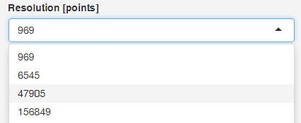
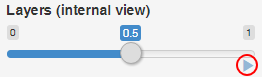

## Help

### 1. Quick theoretical introduction

A confusion matrix for binary classification consists of four entries: $\mathit{TP}$, $\mathit{FP}$, $\mathit{FN}$, $\mathit{TN}$. However, for a dataset of $n$ examples these four entries are constrained, as $n = \mathit{TP} + \mathit{FP} + \mathit{FN} + \mathit{TN}$. Therefore, for a given constant $n$ any three values in the confusion matrix uniquely define the fourth value. This property allows to visualize any classification performance measure based on the two-class confusion matrix using a 4D barycentric coordinate system. A similar property is true for any two-by-two contingency table, for example, those used to define rule interestingness measures.

| Actual \\ Predicted   | Positive  | Negative  | total  |
|:-:|:-:|:-:|:-:|
| **Positive**  | $\mathit{TP}$  | $\mathit{FN}$ |  $P$ |
| **Negative**  | $\mathit{FP}$  | $\mathit{TN}$ |  $N$ |
| **total**  |  $\widehat{P}$ | $\widehat{N}$  | $n$  |

The *barycentric coordinate system* is a coordinate system in which point locations are specified relatively to hyper-sides (sides of the triangle, faces of the tetrahedron, etc.) of a simplex (a triangle, tetrahedron, etc.). A 4D barycentric coordinate system is a tetrahedron, where each dimension is represented as one of the four vertices. Choosing vectors that represent $\mathit{TP}$, $\mathit{FP}$, $\mathit{FN}$, $\mathit{TN}$ as vertices of a regular tetrahedron in a 3D space, one arrives at a barycentric coordinate system depicted below.

In this system, every confusion matrix $\left[ \begin{smallmatrix} \mathit{TP} & \mathit{FN} \\ \mathit{FP} & \mathit{TN} \end{smallmatrix} \right]$ is represented as a point of the tetrahedron. Let us illustrate this fact with a few examples. The above plot shows a skeleton of a tetrahedron with four exemplary points:

- one located in vertex $\mathsf{TP}$, which represents $\left[ \begin{smallmatrix} n & 0 \\ 0 & 0 \end{smallmatrix} \right]$,
- one located in the middle of edge $\mathsf{TP}$--$\mathsf{FP}$, which represents $\left[ \begin{smallmatrix} n/2 & 0 \\ n/2 & 0 \end{smallmatrix} \right]$,
- one located in the middle of face $\triangle\mathsf{TP}$--$\mathsf{FP}$--$\mathsf{FN}$, which represents $\left[ \begin{smallmatrix} n/3 & n/3 \\ n/3 & 0 \end{smallmatrix} \right]$,
- one located in the middle of the tetrahedron, which represents $\left[ \begin{smallmatrix} n/4 & n/4 \\ n/4 & n/4 \end{smallmatrix} \right]$.

One way of understanding this representation is to imagine a point in the tetrahedron as the center of mass of the examples in a confusion matrix. If all $n$ examples are true positives, then the entire mass of the predictions is at $\mathit{TP}$ and the point coincides with vertex $\mathsf{TP}$. If all examples are false negatives, the point lies on vertex $\mathsf{FN}$, etc. Generally, whenever $a > b$ ($a, b \in \{\mathit{TP},\mathit{FN},\mathit{FP},\mathit{TN}\}$) then the point is closer to the vertex corresponding to $a$ rather than $b$.

Using the barycentric coordinate system makes it possible to depict the originally 4D data (two-class confusion matrices) as points in 3D. Moreover, an additional variable based on the depicted four values may be rendered as color. In this application, we adapt this procedure to color-code the values of classification performance and rule interestingness measures.

Detailed information about the visualization and its applications can be found in <a href="https://www.amcs.uz.zgora.pl/?action=paper&paper=827" target="_blank">(Susmaga & Szczech, 2015)</a> and <a href="https://www.sciencedirect.com/science/article/pii/S0020025518304602" target="_blank">(Brzezinski et al., 2018)</a>.

### 2. Rotating and zooming the tetrahedron

The tetrahedron visualization can be rotated and zoomed. To
rotate the tetrahedron simply **drag** (click with left button and move mouse) 
the tetrahedron. To zoom in and out use the **scroll wheel** or right mouse
button.

### 3. Configuring the visualization

You can configure the visualization by using the inputs available in the left sidebar (upper panel on small screens). The basic configuration options involve:

- **Selecting a predefined measure**: You can select one of several predefined measures grouped into three categories: *Classification*, *Interestingness*, and *Misc*. Just pick one of the measures names from the *Measure* combo box. If you know the name of the measure you are looking for, you can also start typing the name in the combo box to find the measure without scrolling through all the measures. The measures are sorted alphabetically within each of the three groups. Formulas for the predefined measures are available in the *Measure definitions* tab.  
- **Visualizing a custom measure**: It is possible to define a custom measure to be visualized. For this purpose use the *Custom function* and write the desired formula. Within the formula you can use variables $a$, $b$, $c$, $d$, $tp$, $fp$, $fn$, $tn$, $n$, $p1$, $p2$, numbers, and math operators (+, -, \*, /, \^). For example, a valid measure definition would be: $a/(b-c)$. Variables $a$, $b$, $c$, $d$ correspond to variables with the same names commonly used to define rule interestingness measures. For classification $tp=a$, $fp=b$, $fn=c$, $tn=d$ can be used, therefore, classification accuracy would be defined as: $(tp+tn)/(tp+fp+fn+tn)$. The variable $n$ is the same as $a+b+c+d$ or $tp+fp+fn+tn$, therefore, accuracy might as well be defined as $(tp+tn)/n$. The last two variables ($p1$ and $p2$) can be used to parameterize the function. The application allows the user to [animate](#help-animation) parameter changes, which can be useful when trying to understand the effects of using different parameter values. A popular parameterized classification measure is $F_{\beta}$ which could be defined as: $(1+p1*p1)*tp/(tp+fn)*tp/(tp+fp) / (p1*p1*tp/(tp+fp) + tp/(tp+fn))$. 
- **Defining the tetrahedron resolution**: The *Resolution [points]* combo box gives the possibility of changing the number of points used to render the tetrahedron. Smaller resolutions yield faster rendering (useful when [animating the tetrahedron](#help-animation)), whereas higher resolutions depict measure values with more detail and can be useful for making [snapshots](#help-save). The highest resolution (156849) is particularly demanding and can take some time to render. 
- **Selecting a color palette**: Measure values can be visualized using one of 12 predefined color palettes. Most of the palettes are based on diverging and sequential color schemes from http://colorbrewer2.org. 
- **Setting the color used for undefined values**: Undefined values (NaNs) can be visualized using a color defined by the user. It is best if the selected color differs from those used in the palette. 
- **Selecting the point size**: It is possible to change size of points in the tetrahedron. This gives a way of looking through the layers of tetrahedron or creating solid planes. 
- **Selecting an internal view of the tetrahedron**: This options allows the user to hide the external layers and take a look inside the tetrahedron. This option can be [animated](#help-animation). 
- **Defining the amount of text on the visualization**: Options *Show measure name on plot*, *Show labels*, and *Show tetrahedron wireframe* change the amount of additional data plotted next to the tetrahedron. 

### 4. Snapshots and saving the tetrahedron to an html file

The tetrahedron is rendered using WebGL and there are two ways of exporting the visualization: to a static png image or to an html file with an interactive WebGL object. Both options are available via buttons in the sidebar.

The static snapshot saves the current view of the tetrahedron, therefore rotating and making several snapshots may be useful when trying to depict the entire tetrahedron. The exported html file, on the other hand, is interactive and can be rotated and zoomed. The html file can be embedded in websites or html-based presentations. If you want to make the tetrahedron smaller or larger, look for `"viewer":` and `"browser:"` properties in the `<script type="application/htmlwidget-sizing" ...>` tag of the exported html.

### 5. Animations

Some of the application options can be animated. These options can change the visualization parameters automatically in constant intervals creating an animation. To trigger such an animation look for the <i class="glyphicon glyphicon-play" style="color: #337ab7"></i> button  underneath sliders. Animated options include: *Layers (internal view)*, *Minority ratio*, *Measure parameter (alpha)*, *Measure parameter (beta)*,  *Measure parameter (p1)*, *Measure parameter (p2)*.

### 6. Parameterized measures

Selected predefined measures and custom measures can be parameterized. A parameterized measure contains a user defined parameter in its formula. Predefined parameters are named alpha and beta, whereas in custom measures parameters can be added to formulas using variables $p1$ and $p2$, respectively. The alpha, beta, p1, p2 parameters are animated options. Predefined parameterized measures include: *IBA(G-mean)*, *IBA(F1 score)*, *IBA(Fb-measure)*, *IBA(Accuracy)*, *Fb-measure*, *c1*, *c2*.

### 7. Cross-sections

A useful way of visualizing measure values can also be achieved be cutting the tetrahedron with a plane and analyzing the obtained slice. There are many possible ways of cutting the tetrahedron, but in this application we highlight cross-sections shown on the figure below.

The indicated cross-sections are of particular interest in the context of analyzing classification measures for class imbalance problems. Traversing the tetrahedron alongside the vertical axis (up-down in the above figure) corresponds to changing the proportions between sums $\mathit{TP}+\mathit{FN} = P$ and $\mathit{FP}+\mathit{TN} = N$. This has an important implication, because these two values specify the probability distribution of the actual classes. If  $P = N$, then a situation of balanced classes is reproduced; otherwise the classes are imbalanced.

How a measure behaves for a particular class proportion may be visualized by producing a cross-section of the tetrahedron with a horizontal plane that cuts its vertical height. The above figure shows two cross-sections, one at $P/n = 1/2$ (class balance, middle plot) and one at $P/n = 1/6$ (positive class as the minority class, right plot). It is worth noting that the proportion of the rectangle's side lengths follows that of $P$ (the horizontal side) and $N$ (the vertical side). 

### 8. Configuring cross-sections

Cross-sections mostly have same [configuration options](#help-conf) as the tetrahedron. The additional options are:

- **Setting the minority ratio**: This option picks the height at which the cross-section will be performed. A minority ratio value of 0.5 corresponds to creating a cross-section when both of the classes encompass 50% of the dataset, whereas a value of 0.1 corresponds to one class having 10% of the examples and the second class having 90% of the examples. The minority ratio is similar to the *skew-ratio*. This parameter can be animated. 
- **Plotting the contours of measure values**: Setting this options adds a contour plot as an additional layer to the plot. This is an alternative way of visualizing the "shape" of measure values, often denoted as *iso-lines*. 

### 9. Contact

Feel free to write any comments or suggestions at: **dariusz.brzezinski (at) cs.put.poznan.pl**

<a href="#" onclick="$('body,html').animate({scrollTop : 0}, 500);" class="return-to-top" title="Scroll to top"><i class="fa fa-chevron-up"></i></a>

